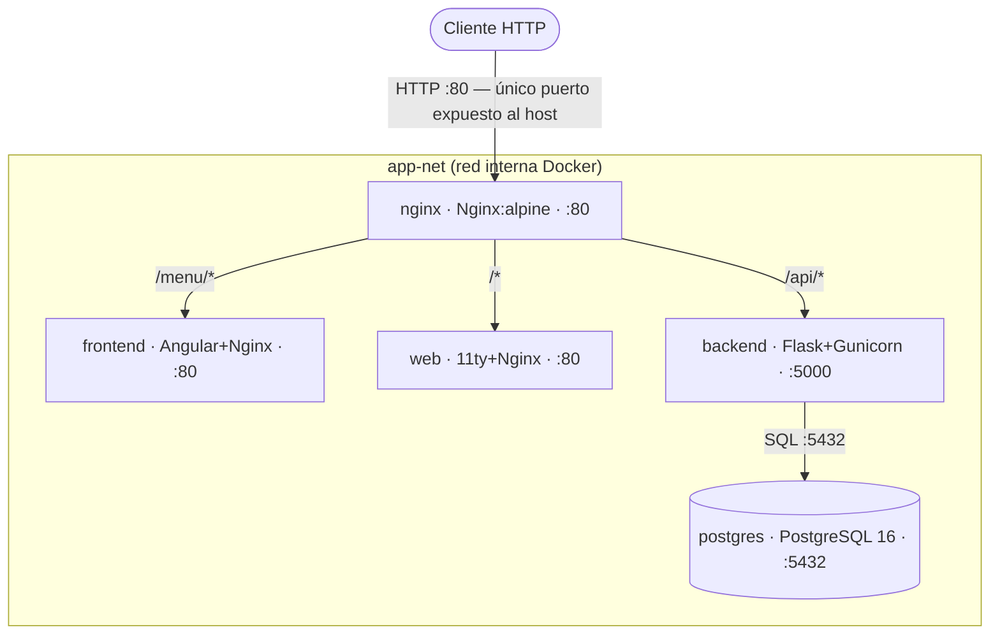

# Stay Sidekick

[](https://github.com/sdurutr436/tfg-alberti/actions/workflows/ci-python.yml)
[](https://github.com/sdurutr436/tfg-alberti/actions/workflows/ci-angular.yml)
[](https://github.com/sdurutr436/tfg-alberti/actions/workflows/docker-publish.yml)

TFG DAW 2 — Plataforma para la gestión de solicitudes de estancia.

Imágenes publicadas en [Docker Hub — sdurutr436](https://hub.docker.com/u/sdurutr436).

## Arquitectura

El proyecto está dividido en tres capas independientes:

| Capa | Tecnología | Puerto | Descripción |
|------|-----------|--------|-------------|
| `web/` | [11ty](https://www.11ty.dev/) + Nunjucks | `8080` | Sitio estático: landing, legales, empresa, producto |
| `frontend/` | [Angular](https://angular.dev/) | `4200` | Aplicación dinámica: panel de usuario, solicitudes |
| `backend/` | [Flask](https://flask.palletsprojects.com/) | `5000` | API REST: formularios, autenticación, notificaciones |

Los estilos SCSS son **compartidos** entre `web/` y `frontend/`: ambos compilan desde `frontend/src/styles/` siguiendo la arquitectura [ITCSS](https://www.xfive.co/blog/itcss-scalable-maintainable-css-architecture/) con nomenclatura [BEM](https://getbem.com/).

### Arquitectura Docker



Una petición autenticada recorre el siguiente camino: el cliente envía la solicitud HTTP al puerto 80 del host, donde **nginx** actúa como proxy inverso y la enruta según el prefijo — `/api/*` se redirige al **backend** Flask (Gunicorn en puerto 5000), que consulta **PostgreSQL** (puerto 5432) y devuelve una respuesta JSON. nginx reenvía esa respuesta al cliente. El resto de rutas sirven la SPA Angular (`/menu/*`) o el sitio estático 11ty (`/*`). Todo el tráfico entre servicios circula por la red interna `app-net`; el único puerto expuesto al host es el 80.

## Inicio rápido

### Prerrequisitos

- Node.js ≥ 18
- Python ≥ 3.11
- npm ≥ 10

### Levantar frontend + sitio estático (una sola orden)

**Linux / macOS:**
```bash
chmod +x dev.sh
./dev.sh
```

**Windows:**
```bat
dev.bat
```

O directamente con npm:
```bash
npm install
npm run dev
```

Esto levanta en paralelo:
- **http://localhost:8080** — Sitio estático (11ty)
- **http://localhost:4200** — App Angular

### Levantar cada servicio por separado

```bash
# Sitio estático
npm run dev:web        # cd web && npm start

# App Angular
npm run dev:app        # cd frontend && npm start

# Backend Flask (ver docs/backend/VENV_SETUP.md)
cd backend && python run.py
```

### Instalar todas las dependencias Node de una vez

```bash
npm run install:all
```

### Levantar con Docker (entorno completo)

Docker levanta todos los servicios juntos (nginx, frontend, web, backend, PostgreSQL) en
un único comando. Es la forma más fácil de probar el stack completo en local.

**Primer uso** — preparar los `.env`:
```bash
cp .env.example .env                   # variables de PostgreSQL y Turnstile
cp backend/.env.example backend/.env   # completar con tus valores
# web/.env ya está incluido con la key de prueba de Turnstile (dev)
```

**Arrancar:**
```bash
docker compose up --build        # construye imágenes y arranca (foreground)
docker compose up -d --build     # igual pero en background
```

> Primera vez: si el volumen ya existía sin el seed, borrar y recrear:
> ```bash
> docker compose down -v && docker compose up -d --build
> ```

**Comandos del día a día:**
```bash
docker compose ps                # ver qué contenedores están corriendo
docker compose logs -f           # seguir logs de todos los servicios
docker compose logs -f backend   # logs solo del backend
docker compose restart backend   # reiniciar un único servicio
docker compose stop              # parar todos los contenedores (conserva datos)
docker compose down              # parar y eliminar contenedores (conserva volúmenes)
docker compose down -v           # parar, eliminar contenedores Y la base de datos
```

**URLs tras arrancar:**

| URL | Servicio |
|-----|---------|
| http://localhost/ | Sitio estático (11ty) |
| http://localhost/menu/ | App Angular |
| http://localhost/api/ | API Flask |

**Credenciales de acceso (creadas por el seed de desarrollo):**

| Campo | Valor |
|-------|-------|
| Email | `dev@staysidekick.es` |
| Contraseña | `admin123` |
| Rol | superadmin |

> Estas credenciales son solo para entorno local. En producción, generar credenciales nuevas.

> Referencia completa de comandos, troubleshooting y variables de entorno: [docs/devops/docker-local.md](docs/devops/docker-local.md)

## Estructura del proyecto

```
tfg-alberti/
├── web/                    # Sitio estático — 11ty + Nunjucks
│   ├── src/
│   │   ├── _includes/      # Layouts y partials Nunjucks
│   │   ├── _data/          # Datos globales del sitio
│   │   ├── assets/styles/  # SCSS entry (compila desde frontend/src/styles/)
│   │   ├── producto/       # Páginas de producto
│   │   ├── legal/          # Páginas legales
│   │   └── empresa/        # Páginas de empresa
│   └── eleventy.config.js
│
├── frontend/               # App Angular (SPA)
│   └── src/
│       ├── app/
│       │   └── components/ # Componentes standalone (header, footer…)
│       └── styles/         # SCSS compartido con web/ (ITCSS)
│           ├── settings/   # Variables: tipografía, colores, breakpoints
│           ├── tools/      # Mixins reutilizables
│           ├── generic/    # Resets CSS
│           ├── elements/   # Estilos base de elementos HTML
│           ├── layout/     # Grid, flex, contenedor
│           ├── components/ # Átomos y organismos BEM
│           ├── utilities/  # Clases de utilidad
│           └── animations/ # Keyframes y transiciones
│
├── backend/                # API REST Flask
│   └── app/
│       ├── contact/        # Módulo de formulario de contacto
│       ├── security/       # CSRF, honeypot, JWT
│       └── services/       # Gmail, Discord, Turnstile
│
├── docs/                   # Documentación del proyecto
├── package.json            # Orquestador de desarrollo (concurrently)
├── dev.sh                  # Inicio rápido Linux / macOS
└── dev.bat                 # Inicio rápido Windows
```

## Documentación

| Documento | Contenido |
|-----------|-----------|
| [DEPLOY.md](DEPLOY.md) | Guía consolidada de despliegue (local + Railway) |
| [docs/DESARROLLO.md](docs/DESARROLLO.md) | Guía completa de entorno de desarrollo |
| [docs/devops/docker-local.md](docs/devops/docker-local.md) | Referencia Docker para desarrollo local |
| [docs/backend/DEPENDENCIAS.md](docs/backend/DEPENDENCIAS.md) | Librerías del backend y justificación |
| [docs/backend/VENV_SETUP.md](docs/backend/VENV_SETUP.md) | Configuración del entorno virtual Python |
| [docs/design/decisiones_disenio.md](docs/design/decisiones_disenio.md) | Decisiones de arquitectura y diseño |
| [docs/design/wireframes_figma.md](docs/design/wireframes_figma.md) | Referencias a wireframes en Figma |
