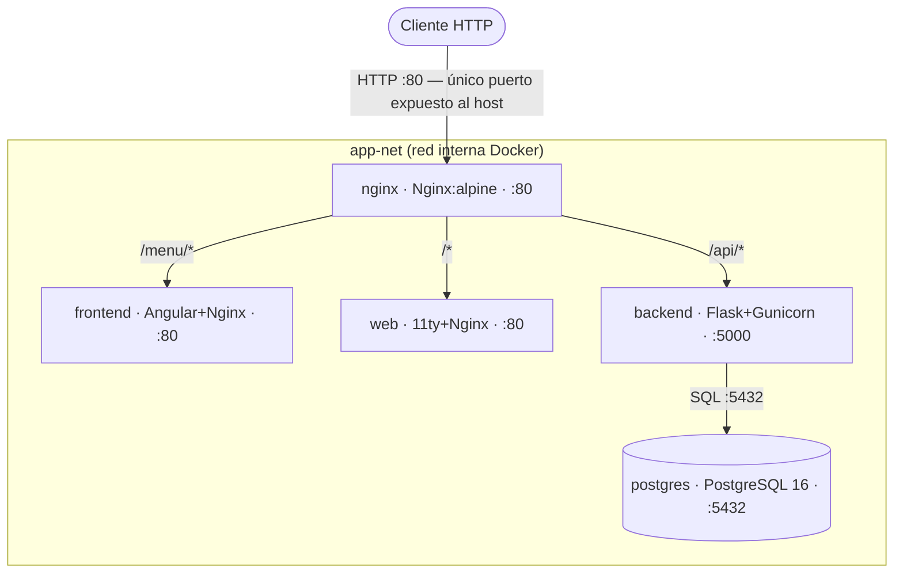

<div align="center">

  # Stay Sidekick

  

  ## La capa satélite para la gestión operacional en tu empresa vacacional

  > **Accede directamente:** [https://stay-sidekick.com](https://stay-sidekick.com)

</div>

---

<div align="center">

[](https://github.com/sdurutr436/stay-sidekick/actions/workflows/ci-python.yml)
[](https://github.com/sdurutr436/stay-sidekick/actions/workflows/ci-angular.yml)
[](https://github.com/sdurutr436/stay-sidekick/actions/workflows/ci-angular-tests.yml)
[](https://github.com/sdurutr436/stay-sidekick/actions/workflows/ci-web.yml)

</div>

---

Stay Sidekick es una plataforma web para equipos de alojamiento turístico que agrupa, en un mismo stack, una landing pública, un panel de trabajo privado y una API REST para operaciones como gestión de solicitudes, herramientas multiempresa, sincronización de contactos y automatizaciones de apoyo.

- Producción pública: [stay-sidekick.up.railway.app](https://stay-sidekick.up.railway.app)
- Imágenes publicadas: [Docker Hub - sdurutr436](https://hub.docker.com/u/sdurutr436)

## Índice

- [Qué incluye](#qué-incluye)
- [Características principales](#características-principales)
  - [Maestro de apartamentos](#maestro-de-apartamentos)
  - [Mapa de calor operativo](#mapa-de-calor-operativo)
  - [Notificaciones de check-in tardío](#notificaciones-de-check-in-tardío)
  - [Sincronizador de contactos con Google](#sincronizador-de-contactos-con-google)
  - [Vault de comunicaciones asistido por IA](#vault-de-comunicaciones-asistido-por-ia)
  - [Multiempresa, usuarios y roles](#multiempresa-usuarios-y-roles)
  - [Perfil e integraciones por empresa](#perfil-e-integraciones-por-empresa)
  - [Formulario de contacto público](#formulario-de-contacto-público)
  - [Seguridad y cumplimiento transversales](#seguridad-y-cumplimiento-transversales)
  - [Interfaz y experiencia de usuario](#interfaz-y-experiencia-de-usuario)
- [Stack técnico](#stack-técnico)
- [Arquitectura](#arquitectura)
- [Inicio rápido](#inicio-rápido)
- [Estructura del proyecto](#estructura-del-proyecto)
- [Documentación](#documentación)
- [Colaboración y mantenimiento](#colaboración-y-mantenimiento)

## Qué incluye

- `web/`: sitio estático con contenido público, legal y corporativo.
- `frontend/`: SPA Angular para el panel operativo.
- `backend/`: API REST Flask para autenticación, negocio y notificaciones.
- `nginx/`: proxy inverso que publica `/`, `/menu/` y `/api/` en una única entrada.

## Características principales

Stay Sidekick es una **capa satélite** para operaciones del alquiler vacacional: no sustituye al PMS, cubre las tareas que suelen resolverse de forma manual o con herramientas dispersas. Las funcionalidades se agrupan por área operativa.

### Maestro de apartamentos
- **Catálogo centralizado por empresa** — alta, edición y baja lógica del inventario sobre el que operan el resto de módulos.
- **Sincronización con PMS** — integración con Smoobu como primer PMS operativo demostrable, arquitectura extensible.
- **Importación masiva por XLSX** — mecanismo de respaldo cuando no hay API, con vista previa antes de persistir cambios.

### Mapa de calor operativo
- **Visualización de la carga diaria** — entradas y salidas en un rango de fechas para anticipar picos de operación.
- **Doble origen: PMS o XLSX** — la misma vista con o sin integración API, con configuración de columnas adaptable.
- **Umbrales de intensidad configurables por empresa** — adapta el semáforo operativo al volumen real de cada cliente.
- **Procesado en memoria, sin persistencia** — los datos de reservas no se guardan en BD (alineado con RGPD).

### Notificaciones de check-in tardío
- **Detección automática de check-ins del día** — desde el PMS o cargando un XLSX cuando no hay integración API.
- **Plantillas de mensaje editables** — CRUD por empresa para estandarizar tono y reducir tiempos de respuesta.
- **Hora de corte y reglas por empresa** — definen cuándo se considera tardío y cómo se notifica.

### Sincronizador de contactos con Google
- **Conexión vía OAuth 2.0 con Google People API** — alta y baja de la cuenta del administrador.
- **Sincronización PMS → Google Contacts** — agrupa huéspedes por nombre y teléfono, con flujo alternativo XLSX para operaciones sin API.
- **Exportación CSV** — fallback para auditoría, respaldo o cargas externas.
- **Preferencias configurables por empresa** — qué sincronizar y cómo mostrar los contactos en la agenda.
- **Datos de huéspedes en memoria, no persisten en BD** (RGPD).

### Vault de comunicaciones asistido por IA
- **Catálogo de plantillas por categoría e idioma** — CRUD completo con borrado lógico (`PlantillaVault`).
- **Asistente IA para mejorar y traducir redacción** — opcional, configurable por empresa.
- **Contadores de uso de IA compartida** — `AiUsageLog` para controlar el consumo del free tier.
- **Configuración segura de proveedor IA propio** — para empresas que aporten su propia API key.
- **System prompts editables desde admin** — sin necesidad de tocar código.

### Multiempresa, usuarios y roles
- **Arquitectura multi-tenant** — separación lógica de datos por empresa en todas las queries.
- **Gestión de usuarios por empresa** — alta, baja, cambio de rol y reseteo de contraseña por parte del administrador.
- **Rol superadmin** — gestiona el alta de empresas y la supervisión global del sistema.
- **Permisos por rol** — los usuarios no administradores pueden consultar la configuración pero no modificarla.

### Perfil e integraciones por empresa
- **Configuración no-code** — claves de PMS y de IA, columnas XLSX, umbrales, reglas de módulos, todo desde el panel.
- **Credenciales sensibles cifradas en BD** — las API keys de PMS se almacenan cifradas (`common/crypto.py`).
- **Cambio de contraseña del usuario autenticado** — desde el área de perfil.

### Formulario de contacto público
- **Endpoint público para captación comercial y soporte inicial** — sin exponer la zona privada.
- **Anti-spam por capas** — validación de datos, Cloudflare Turnstile, campo *honeypot* oculto y rate limit por IP.

### Seguridad y cumplimiento transversales
- **Autenticación JWT HS256** — con duración configurable (`JWT_ACCESS_TOKEN_HOURS`).
- **Hashing BCrypt** para contraseñas (`auth/passwords.py`), con factor de coste configurable.
- **Protección CSRF Double-Submit Cookie** en operaciones de escritura.
- **CORS** restringido por orígenes permitidos.
- **Rate limiting por IP** en endpoints sensibles para mitigar abuso y fuerza bruta.
- **Aislamiento de datos entre empresas** a nivel de query.
- **Enfoque RGPD-aware** — los datos operativos de huéspedes se procesan en memoria sin persistir.

### Interfaz y experiencia de usuario
- **SPA Angular 21** — navegación lateral, dashboard de estado de herramientas y conexiones externas.
- **Modo claro/oscuro** persistido por usuario.
- **Diseño responsive** — pensado para recepción, oficina y uso en movilidad.
- **Modal "cómo funcionan las herramientas"** integrado en cada módulo para reducir curva de aprendizaje.
- **Auditoría de accesibilidad WAVE + Lighthouse** publicada en la memoria técnica, con objetivo WCAG 2.1 AA.
- **Feedback explícito** — indicadores de carga, mensajes de éxito/error accionables y confirmaciones en acciones destructivas.

## Stack técnico

| Área | Stack real del repositorio |
|------|-----------------------------|
| Sitio público |    |
| Aplicación |  |
| Backend |    |
| Infraestructura |    |
| Calidad |      |

Los estilos SCSS son **compartidos** entre `web/` y `frontend/`: ambos compilan desde `frontend/src/styles/` siguiendo la arquitectura [ITCSS](https://www.xfive.co/blog/itcss-scalable-maintainable-css-architecture/) con nomenclatura [BEM](https://getbem.com/).

## Arquitectura

El proyecto está dividido en tres capas independientes:

### Arquitectura Docker


```mermaid
graph TD
    Cliente(["Cliente HTTP"])

    subgraph app-net["app-net (red interna Docker)"]
        Nginx["nginx · Nginx:alpine · :80"]
        Frontend["frontend · Angular+Nginx · :80"]
        Web["web · 11ty+Nginx · :80"]
        Backend["backend · Flask+Gunicorn · :5000"]
        Postgres[("postgres · PostgreSQL 16 · :5432")]
    end

    Cliente -->|"HTTP :80 — único puerto expuesto al host"| Nginx
    Nginx -->|"/api/*"| Backend
    Nginx -->|"/menu/*"| Frontend
    Nginx -->|"/*"| Web
    Backend -->|"SQL :5432"| Postgres
```

Una petición autenticada recorre el siguiente camino: el cliente envía la solicitud HTTP al puerto 80 del host, donde **nginx** actúa como proxy inverso y la enruta según el prefijo — `/api/*` se redirige al **backend** Flask (Gunicorn en puerto 5000), que consulta **PostgreSQL** (puerto 5432) y devuelve una respuesta JSON. nginx reenvía esa respuesta al cliente. El resto de rutas sirven la SPA Angular (`/menu/*`) o el sitio estático 11ty (`/*`). Todo el tráfico entre servicios circula por la red interna `app-net`; el único puerto expuesto al host es el 80.

## Inicio rápido

### Prerrequisitos

- `Node.js` 18 o superior
- `npm` 10 o superior
- `Python` 3.12 o superior
- `Docker` version 24 o más, para levantar el stack completo

### Levantar frontend + sitio estático (una sola orden)

**Linux / macOS:**
```bash
chmod +x dev.sh
./dev.sh
```

**Windows:**
```bat
dev.bat
```

Alternativa directa con npm:

```bash
npm install
npm run dev
```

Esto levanta en paralelo:
- **http://localhost:8080** — Sitio estático (11ty)
- **http://localhost:4200** — App Angular

### Arranque por servicio
```bash
# Sitio estático
npm run dev:web        # cd web && npm start

# App Angular
npm run dev:app        # cd frontend && npm start

# Backend Flask (ver docs/backend/VENV_SETUP.md)
cd backend && python run.py
```

### Instalar todas las dependencias Node de una vez

```bash
npm run install:all
```

### Levantar con Docker (entorno completo)

Docker levanta todos los servicios juntos (nginx, frontend, web, backend, PostgreSQL) en
un único comando. Es la forma más fácil de probar el stack completo en local.

**Primer uso** -> preparar los `.env`:
```bash
cp .env.example .env                   # variables de PostgreSQL y Turnstile
cp backend/.env.example backend/.env   # completar con tus valores
# web/.env ya está incluido con la key de prueba de Turnstile (dev)
```

**Levantar:**
```bash
docker compose up --build        # construye imágenes y arranca (foreground)
docker compose up -d --build     # igual pero en background
```

> Primera vez: si el volumen ya existía sin el seed, borrar y recrear:
> ```bash
> docker compose down -v && docker compose up -d --build
> ```

**Comandos útiles:**
```bash
docker compose ps                # ver qué contenedores están corriendo
docker compose logs -f           # seguir logs de todos los servicios
docker compose logs -f backend   # logs solo del backend
docker compose restart backend   # reiniciar un único servicio
docker compose stop              # parar todos los contenedores (conserva datos)
docker compose down              # parar y eliminar contenedores (conserva volúmenes)
docker compose down -v           # parar, eliminar contenedores Y la base de datos
```

**URLs tras levantar:**

| URL | Servicio |
|-----|---------|
| http://localhost/ | Sitio estático (11ty) |
| http://localhost/menu/ | App Angular |
| http://localhost/api/ | API Flask |

**Credenciales de acceso (creadas por el seed de desarrollo):**

| Campo | Valor |
|-------|-------|
| Email | `dev@staysidekick.es` |
| Contraseña | `admin123` |
| Rol | `admin` (con `es_superadmin=true`) |

> Estas credenciales son solo para entorno local. En producción, generar credenciales nuevas.

## Estructura del proyecto

```
tfg-alberti/
├── web/                    # Sitio estático — 11ty + Nunjucks
│   ├── src/
│   │   ├── _includes/      # Layouts y partials Nunjucks
│   │   ├── _data/          # Datos globales del sitio
│   │   ├── assets/styles/  # SCSS entry (compila desde frontend/src/styles/)
│   │   ├── producto/       # Páginas de producto
│   │   ├── legal/          # Páginas legales
│   │   └── empresa/        # Páginas de empresa
│   └── eleventy.config.js
│
├── frontend/               # App Angular (SPA)
│   └── src/
│       ├── app/
│       │   └── components/ # Componentes standalone (header, footer…)
│       └── styles/         # SCSS compartido con web/ (ITCSS)
│           ├── settings/   # Variables: tipografía, colores, breakpoints
│           ├── tools/      # Mixins reutilizables
│           ├── generic/    # Resets CSS
│           ├── elements/   # Estilos base de elementos HTML
│           ├── layout/     # Grid, flex, contenedor
│           ├── components/ # Átomos y organismos BEM
│           ├── utilities/  # Clases de utilidad
│           └── animations/ # Keyframes y transiciones
│
├── backend/                # API REST Flask
│   └── app/
│       ├── contact/        # Módulo de formulario de contacto
│       ├── security/       # CSRF, honeypot, JWT
│       └── services/       # Gmail, Discord, Turnstile
│
├── docs/                   # Documentación del proyecto
├── package.json            # Orquestador de desarrollo (concurrently)
├── dev.sh                  # Inicio rápido Linux / macOS
└── dev.bat                 # Inicio rápido Windows
```

## Documentación

| Documento | Contenido |
|-----------|-----------|
| [DEPLOY.md](DEPLOY.md) | Despliegue local y producción en Railway |
| [docs/01-introduccion.md](docs/01-introduccion.md) a [docs/10-conclusiones.md](docs/10-conclusiones.md) | Memoria técnica principal del proyecto |
| [docs/DESARROLLO.md](docs/DESARROLLO.md) | Guía de entorno y flujo de trabajo |
| [docs/backend/DEPENDENCIAS.md](docs/backend/DEPENDENCIAS.md) | Dependencias del backend y justificación |
| [docs/backend/VENV_SETUP.md](docs/backend/VENV_SETUP.md) | Entorno virtual Python |
| [docs/design/decisiones_disenio.md](docs/design/decisiones_disenio.md) | Decisiones de diseño y arquitectura |
| [docs/propuesta_formal/propuesta_formal_sergio_duran_2DAW.md](docs/propuesta_formal/propuesta_formal_sergio_duran_2DAW.md) | Propuesta formal del proyecto |

## Colaboración y mantenimiento

- [CONTRIBUTING.md](CONTRIBUTING.md)
- [CODE_OF_CONDUCT.md](CODE_OF_CONDUCT.md)
- [SECURITY.md](SECURITY.md)
- [LICENSE](LICENSE)