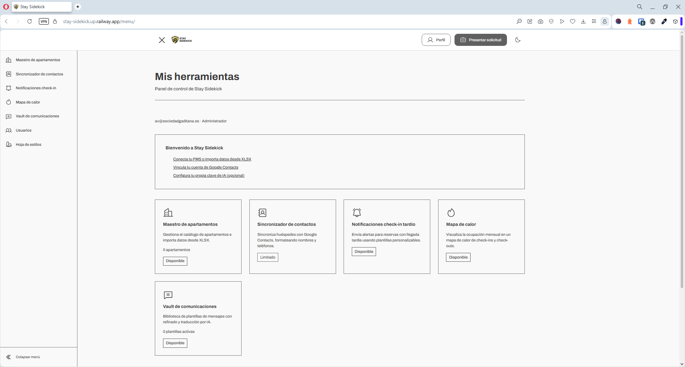
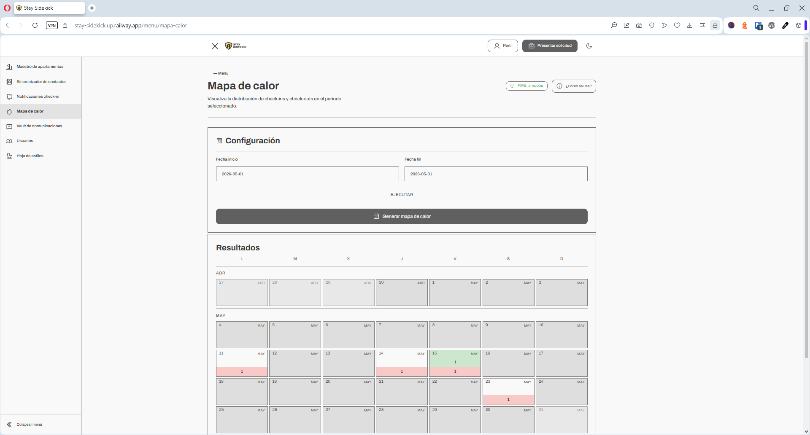
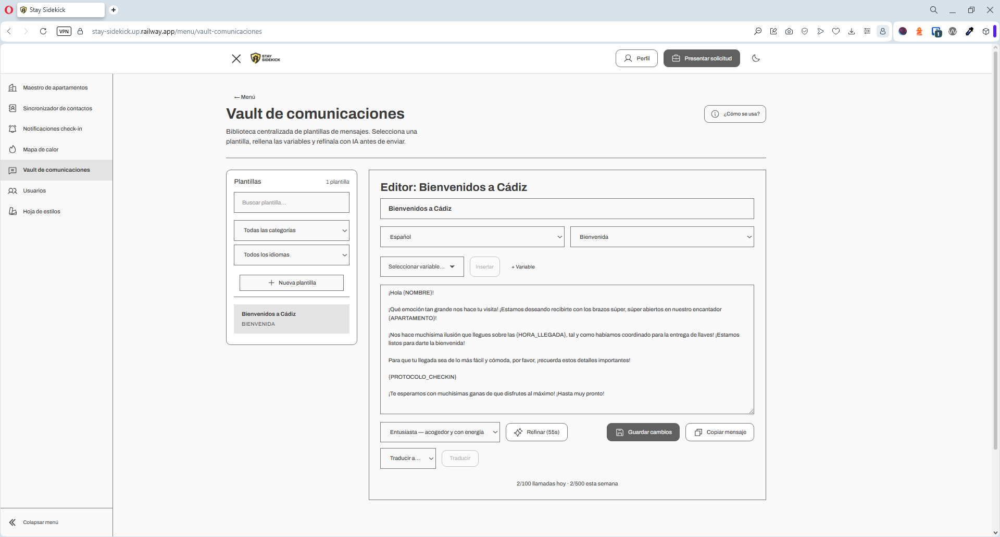

<div align="center">

  # Stay Sidekick

  

  ## La capa satélite para la gestión operacional en tu empresa vacacional

  > **Accede directamente:** [https://stay-sidekick.com](https://stay-sidekick.com)

</div>

---

<div align="center">

[](https://github.com/sdurutr436/stay-sidekick/actions/workflows/ci-python.yml)
[](https://github.com/sdurutr436/stay-sidekick/actions/workflows/ci-angular.yml)
[](https://github.com/sdurutr436/stay-sidekick/actions/workflows/ci-angular-tests.yml)
[](https://github.com/sdurutr436/stay-sidekick/actions/workflows/ci-web.yml)

</div>

---

Stay Sidekick es una plataforma web full-stack **multiempresa** para equipos de alojamiento turístico que funciona como **capa satélite** a los PMS existentes (Smoobu, Beds24, KrossBooking…). Reúne en un mismo stack una landing pública (**11ty**), un panel privado (**Angular 21**) y una API REST (**Flask**) que cubren tareas operativas que los PMS no resuelven de forma suficiente: maestro de apartamentos, mapa de calor operativo, notificaciones de check-in tardío, sincronización con Google Contacts y vault de comunicaciones asistido por IA. Todo el stack se contenedoriza con **Docker Compose** y se despliega en producción en [stay-sidekick.com](https://stay-sidekick.com).

El proyecto nace de una experiencia profesional directa: **2 años y 5 meses** como recepcionista en una empresa gestora de apartamentos turísticos. En ese periodo se detectó que el inicio y el final de cada jornada se consumían en tareas repetitivas distribuidas entre PMS, Google y Excel — fricción compartida por distintos compañeros en rotación. De aquel diagnóstico surgieron primero un prototipo en **JavaFX** y después una versión **MERN** que, pese a su carácter básico, sigue en uso real hoy. Stay Sidekick es la evolución de ese recorrido: no sustituye al PMS, lo complementa y se adapta a la operativa concreta de cada empresa.

Técnicamente, el sistema sigue una arquitectura **multi-tenant** real con seguridad por capas (JWT HS256, CSRF *double-submit cookie*, BCrypt, rate limiting, CORS por orígenes y enfoque RGPD por defecto en datos de huéspedes) y calidad verificable: **92 tests de backend** (Python/pytest) y **297 tests de frontend** (Angular/Vitest), con umbral mínimo del 90 % de cobertura en la SPA. Pipeline **CI/CD** con GitHub Actions (lint, tests, build, publicación en Docker Hub y auditoría Trivy semanal), despliegue gestionado en **Railway** con HTTPS terminado en su *edge*, y cumplimiento normativo (RGPD, LSSI-CE, WCAG 2.1 AA).

- Producción pública: [stay-sidekick.com](https://stay-sidekick.com) · espejo en [stay-sidekick.up.railway.app](https://stay-sidekick.up.railway.app)
- Imágenes publicadas: [Docker Hub — sdurutr436](https://hub.docker.com/u/sdurutr436)

## Índice

- [Vistazo del producto](#vistazo-del-producto)
- [Qué incluye](#qué-incluye)
- [Características principales](#características-principales)
  - [Maestro de apartamentos](#maestro-de-apartamentos)
  - [Mapa de calor operativo](#mapa-de-calor-operativo)
  - [Notificaciones de check-in tardío](#notificaciones-de-check-in-tardío)
  - [Sincronizador de contactos con Google](#sincronizador-de-contactos-con-google)
  - [Vault de comunicaciones asistido por IA](#vault-de-comunicaciones-asistido-por-ia)
  - [Multiempresa, usuarios y roles](#multiempresa-usuarios-y-roles)
  - [Perfil e integraciones por empresa](#perfil-e-integraciones-por-empresa)
  - [Formulario de contacto público](#formulario-de-contacto-público)
  - [Seguridad y cumplimiento transversales](#seguridad-y-cumplimiento-transversales)
  - [Interfaz y experiencia de usuario](#interfaz-y-experiencia-de-usuario)
- [Stack técnico](#stack-técnico)
- [Arquitectura](#arquitectura)
- [Inicio rápido](#inicio-rápido)
- [Estructura del proyecto](#estructura-del-proyecto)
- [Tests y análisis de código](#tests-y-análisis-de-código)
- [CI/CD](#cicd)
- [HTTPS](#https)
- [Documentación](#documentación)
- [Licencia](#licencia)
- [Colaboración y mantenimiento](#colaboración-y-mantenimiento)

## Vistazo del producto

<div align="center">
  
  <br/>
  <em>Panel principal — catálogo de herramientas activadas por empresa, con estado de las integraciones externas.</em>
</div>

<table>
  <tr>
    <td align="center" width="50%"></td>
    <td align="center" width="50%"></td>
  </tr>
  <tr>
    <td align="center"><em>Mapa de calor operativo — entradas y salidas diarias con umbrales configurables por empresa.</em></td>
    <td align="center"><em>Vault de comunicaciones — plantillas por categoría e idioma con asistente IA opcional para mejora y traducción.</em></td>
  </tr>
</table>

## Qué incluye

- `web/`: sitio estático con contenido público, legal y corporativo.
- `frontend/`: SPA Angular para el panel operativo.
- `backend/`: API REST Flask para autenticación, negocio y notificaciones.
- `nginx/`: proxy inverso que publica `/`, `/menu/` y `/api/` en una única entrada.

## Características principales

Stay Sidekick es una **capa satélite** para operaciones del alquiler vacacional: no sustituye al PMS, cubre las tareas que suelen resolverse de forma manual o con herramientas dispersas. Las funcionalidades se agrupan por área operativa.

### Maestro de apartamentos
- **Catálogo centralizado por empresa** — alta, edición y baja lógica del inventario sobre el que operan el resto de módulos.
- **Sincronización con PMS** — integración con Smoobu como primer PMS operativo demostrable, arquitectura extensible.
- **Importación masiva por XLSX** — mecanismo de respaldo cuando no hay API, con vista previa antes de persistir cambios.

### Mapa de calor operativo
- **Visualización de la carga diaria** — entradas y salidas en un rango de fechas para anticipar picos de operación.
- **Doble origen: PMS o XLSX** — la misma vista con o sin integración API, con configuración de columnas adaptable.
- **Umbrales de intensidad configurables por empresa** — adapta el semáforo operativo al volumen real de cada cliente.
- **Procesado en memoria, sin persistencia** — los datos de reservas no se guardan en BD (alineado con RGPD).

### Notificaciones de check-in tardío
- **Detección automática de check-ins del día** — desde el PMS o cargando un XLSX cuando no hay integración API.
- **Plantillas de mensaje editables** — CRUD por empresa para estandarizar tono y reducir tiempos de respuesta.
- **Hora de corte y reglas por empresa** — definen cuándo se considera tardío y cómo se notifica.

### Sincronizador de contactos con Google
- **Conexión vía OAuth 2.0 con Google People API** — alta y baja de la cuenta del administrador.
- **Sincronización PMS → Google Contacts** — agrupa huéspedes por nombre y teléfono, con flujo alternativo XLSX para operaciones sin API.
- **Exportación CSV** — fallback para auditoría, respaldo o cargas externas.
- **Preferencias configurables por empresa** — qué sincronizar y cómo mostrar los contactos en la agenda.
- **Datos de huéspedes en memoria, no persisten en BD** (RGPD).

### Vault de comunicaciones asistido por IA
- **Catálogo de plantillas por categoría e idioma** — CRUD completo con borrado lógico (`PlantillaVault`).
- **Asistente IA para mejorar y traducir redacción** — opcional, configurable por empresa.
- **Contadores de uso de IA compartida** — `AiUsageLog` para controlar el consumo del free tier.
- **Configuración segura de proveedor IA propio** — para empresas que aporten su propia API key.
- **System prompts editables desde admin** — sin necesidad de tocar código.

### Multiempresa, usuarios y roles
- **Arquitectura multi-tenant** — separación lógica de datos por empresa en todas las queries.
- **Gestión de usuarios por empresa** — alta, baja, cambio de rol y reseteo de contraseña por parte del administrador.
- **Rol superadmin** — gestiona el alta de empresas y la supervisión global del sistema.
- **Permisos por rol** — los usuarios no administradores pueden consultar la configuración pero no modificarla.

### Perfil e integraciones por empresa
- **Configuración no-code** — claves de PMS y de IA, columnas XLSX, umbrales, reglas de módulos, todo desde el panel.
- **Credenciales sensibles cifradas en BD** — las API keys de PMS se almacenan cifradas (`common/crypto.py`).
- **Cambio de contraseña del usuario autenticado** — desde el área de perfil.

### Formulario de contacto público
- **Endpoint público para captación comercial y soporte inicial** — sin exponer la zona privada.
- **Anti-spam por capas** — validación de datos, Cloudflare Turnstile, campo *honeypot* oculto y rate limit por IP.

### Seguridad y cumplimiento transversales
- **Autenticación JWT HS256** — con duración configurable (`JWT_ACCESS_TOKEN_HOURS`).
- **Hashing BCrypt** para contraseñas (`auth/passwords.py`), con factor de coste configurable.
- **Protección CSRF Double-Submit Cookie** en operaciones de escritura.
- **CORS** restringido por orígenes permitidos.
- **Rate limiting por IP** en endpoints sensibles para mitigar abuso y fuerza bruta.
- **Aislamiento de datos entre empresas** a nivel de query.
- **Enfoque RGPD-aware** — los datos operativos de huéspedes se procesan en memoria sin persistir.

### Interfaz y experiencia de usuario
- **SPA Angular 21** — navegación lateral, dashboard de estado de herramientas y conexiones externas.
- **Modo claro/oscuro** persistido por usuario.
- **Diseño responsive** — pensado para recepción, oficina y uso en movilidad.
- **Modal "cómo funcionan las herramientas"** integrado en cada módulo para reducir curva de aprendizaje.
- **Auditoría de accesibilidad WAVE + Lighthouse** publicada en la memoria técnica, con objetivo WCAG 2.1 AA.
- **Feedback explícito** — indicadores de carga, mensajes de éxito/error accionables y confirmaciones en acciones destructivas.

## Stack técnico

| Área | Stack real del repositorio |
|------|-----------------------------|
| Sitio público |    |
| Aplicación |  |
| Backend |    |
| Infraestructura |    |
| Calidad |      |

Los estilos SCSS son **compartidos** entre `web/` y `frontend/`: ambos compilan desde `frontend/src/styles/` siguiendo la arquitectura [ITCSS](https://www.xfive.co/blog/itcss-scalable-maintainable-css-architecture/) con nomenclatura [BEM](https://getbem.com/).

## Arquitectura

El proyecto está dividido en tres capas independientes:

### Arquitectura Docker


```mermaid
graph TD
    Cliente(["Cliente HTTP"])

    subgraph app-net["app-net (red interna Docker)"]
        Nginx["nginx · Nginx:alpine · :80"]
        Frontend["frontend · Angular+Nginx · :80"]
        Web["web · 11ty+Nginx · :80"]
        Backend["backend · Flask+Gunicorn · :5000"]
        Postgres[("postgres · PostgreSQL 16 · :5432")]
    end

    Cliente -->|"HTTP :80 — único puerto expuesto al host"| Nginx
    Nginx -->|"/api/*"| Backend
    Nginx -->|"/menu/*"| Frontend
    Nginx -->|"/*"| Web
    Backend -->|"SQL :5432"| Postgres
```

Una petición autenticada recorre el siguiente camino: el cliente envía la solicitud HTTP al puerto 80 del host, donde **nginx** actúa como proxy inverso y la enruta según el prefijo — `/api/*` se redirige al **backend** Flask (Gunicorn en puerto 5000), que consulta **PostgreSQL** (puerto 5432) y devuelve una respuesta JSON. nginx reenvía esa respuesta al cliente. El resto de rutas sirven la SPA Angular (`/menu/*`) o el sitio estático 11ty (`/*`). Todo el tráfico entre servicios circula por la red interna `app-net`; el único puerto expuesto al host es el 80.

| Servicio   | Imagen / build         | Puerto host | Rol                                                |
| ---------- | ---------------------- | :---------: | -------------------------------------------------- |
| `nginx`    | `./nginx` (nginx:alpine) | `80`       | Reverse proxy + cabeceras de seguridad (CSP, HSTS…) |
| `frontend` | `./frontend`           | —           | Angular 21 SPA servida por nginx interno (`/menu/*`) |
| `web`      | `./web`                | —           | Sitio estático 11ty servido por nginx interno (`/*`) |
| `backend`  | `./backend`            | —           | API REST Flask + Gunicorn (`/api/*`)                |
| `postgres` | `postgres:16-alpine`   | —           | Persistencia (volumen `postgres_data` + seed inicial) |

Sólo `nginx` publica un puerto al host. El resto de servicios viven en la red Docker interna `app-net` y se comunican por nombre de servicio. En **Railway** se usa la variante `nginx.railway.conf` (activada por `RAILWAY=true`), que resuelve los hostnames internos `.railway.internal` con TTL bajo para evitar IPs caducadas tras redespliegues.

## Inicio rápido

### Prerrequisitos

- `Node.js` 18 o superior
- `npm` 10 o superior
- `Python` 3.12 o superior
- `Docker` version 24 o más, para levantar el stack completo

### Levantar frontend + sitio estático (una sola orden)

**Linux / macOS:**
```bash
chmod +x dev.sh
./dev.sh
```

**Windows:**
```bat
dev.bat
```

Alternativa directa con npm:

```bash
npm install
npm run dev
```

Esto levanta en paralelo:
- **http://localhost:8080** — Sitio estático (11ty)
- **http://localhost:4200** — App Angular

### Arranque por servicio
```bash
# Sitio estático
npm run dev:web        # cd web && npm start

# App Angular
npm run dev:app        # cd frontend && npm start

# Backend Flask
cd backend && python run.py
```

### Instalar todas las dependencias Node de una vez

```bash
npm run install:all
```

### Levantar con Docker (entorno completo)

Docker levanta todos los servicios juntos (nginx, frontend, web, backend, PostgreSQL) en
un único comando. Es la forma más fácil de probar el stack completo en local.

**Primer uso** -> preparar los `.env`:
```bash
cp .env.example .env                   # variables de PostgreSQL y Turnstile
cp backend/.env.example backend/.env   # completar con tus valores
# web/.env ya está incluido con la key de prueba de Turnstile (dev)
```

**Levantar:**
```bash
docker compose up --build        # construye imágenes y arranca (foreground)
docker compose up -d --build     # igual pero en background
```

> Primera vez: si el volumen ya existía sin el seed, borrar y recrear:
> ```bash
> docker compose down -v && docker compose up -d --build
> ```

**Comandos útiles:**
```bash
docker compose ps                # ver qué contenedores están corriendo
docker compose logs -f           # seguir logs de todos los servicios
docker compose logs -f backend   # logs solo del backend
docker compose restart backend   # reiniciar un único servicio
docker compose stop              # parar todos los contenedores (conserva datos)
docker compose down              # parar y eliminar contenedores (conserva volúmenes)
docker compose down -v           # parar, eliminar contenedores Y la base de datos
```

**URLs tras levantar:**

| URL | Servicio |
|-----|---------|
| http://localhost/ | Sitio estático (11ty) |
| http://localhost/menu/ | App Angular |
| http://localhost/api/ | API Flask |

**Credenciales de acceso (creadas por el seed de desarrollo):**

| Campo | Valor |
|-------|-------|
| Email | `dev@staysidekick.es` |
| Contraseña | `admin123` |
| Rol | `admin` (con `es_superadmin=true`) |

> Estas credenciales son solo para entorno local. En producción, generar credenciales nuevas.

### Variables de entorno

El stack se configura mediante tres ficheros `.env` (`.env` raíz, `backend/.env`, `web/.env`), todos versionados como `.env.example`. Resumen de las variables más relevantes:

| Variable                  | Fichero        | Obligatoria      | Descripción                                                          |
| ------------------------- | -------------- | :--------------: | -------------------------------------------------------------------- |
| `POSTGRES_DB/USER/PASSWORD` | `.env`       | sí (prod)        | Credenciales BD (cambiar `POSTGRES_PASSWORD` antes de producción)    |
| `DATABASE_URL`            | `.env`         | sí               | URI de conexión completa (en Railway: `${{ Postgres.DATABASE_URL }}`) |
| `TURNSTILE_SITE_KEY`      | `.env` / `web/.env` | no (default test key) | Site key Cloudflare Turnstile (anti-spam del formulario público) |
| `SECRET_KEY`              | `backend/.env` | **sí**           | Clave principal de Flask (≥ 32 caracteres aleatorios)                |
| `JWT_SECRET_KEY`          | `backend/.env` | **sí**           | Firma HS256 de los JWT del panel                                     |
| `JWT_ACCESS_TOKEN_HOURS`  | `backend/.env` | no               | TTL del token de acceso (default `1`)                                |
| `FERNET_KEY`              | `backend/.env` | **sí**           | Clave Fernet para cifrar API keys de PMS/IA almacenadas en BD        |
| `TURNSTILE_SECRET_KEY`    | `backend/.env` | no               | Verificación server-side del challenge de Turnstile                  |
| `MAIL_GUN_API_KEY/DOMAIN/API_URL` | `backend/.env` | no       | Envío transaccional vía API HTTP de Mailgun (sin SMTP)               |
| `MAIL_FROM`               | `backend/.env` | no               | Remitente visible y destinatario de los formularios públicos         |
| `GOOGLE_CLIENT_ID/SECRET` | `backend/.env` | no               | OAuth 2.0 Google People API (sincronizador de contactos)             |
| `GOOGLE_REDIRECT_URI`     | `backend/.env` | no               | Callback OAuth registrado en Google Cloud                            |
| `DISCORD_WEBHOOK_*`       | `backend/.env` | no               | Webhooks de Discord para solicitudes, contacto y operaciones         |
| `AI_DEFAULT_PROVIDER/MODEL/API_KEY` | `backend/.env` | no     | Proveedor IA por defecto (`gemini`/`openai`/`claude`) + free tier    |
| `AI_FREE_LIMIT_DAILY/WEEKLY` | `backend/.env` | no             | Límites del free tier compartido por empresa                         |
| `SMOOBU_API_KEY`          | `backend/.env` | no               | Integración API REST del PMS de referencia                           |
| `RATE_LIMIT_CONTACT`      | `backend/.env` | no               | Rate limit del formulario público (default `5/hour`)                 |

> Plantillas completas y comentadas en [.env.example](.env.example), [backend/.env.example](backend/.env.example) y [web/.env.example](web/.env.example).

## Estructura del proyecto

```
tfg-alberti/
├── web/                    # Sitio estático — 11ty + Nunjucks
│   ├── src/
│   │   ├── _includes/      # Layouts y partials Nunjucks
│   │   ├── _data/          # Datos globales del sitio
│   │   ├── assets/styles/  # SCSS entry (compila desde frontend/src/styles/)
│   │   ├── producto/       # Páginas de producto
│   │   ├── legal/          # Páginas legales
│   │   └── empresa/        # Páginas de empresa
│   └── eleventy.config.js
│
├── frontend/               # App Angular (SPA)
│   └── src/
│       ├── app/
│       │   └── components/ # Componentes standalone (header, footer…)
│       └── styles/         # SCSS compartido con web/ (ITCSS)
│           ├── settings/   # Variables: tipografía, colores, breakpoints
│           ├── tools/      # Mixins reutilizables
│           ├── generic/    # Resets CSS
│           ├── elements/   # Estilos base de elementos HTML
│           ├── layout/     # Grid, flex, contenedor
│           ├── components/ # Átomos y organismos BEM
│           ├── utilities/  # Clases de utilidad
│           └── animations/ # Keyframes y transiciones
│
├── backend/                # API REST Flask
│   └── app/
│       ├── contact/        # Módulo de formulario de contacto
│       ├── security/       # CSRF, honeypot, JWT
│       └── services/       # Mailgun (HTTP API), Discord, Turnstile
│
├── docs/                   # Documentación del proyecto
├── package.json            # Orquestador de desarrollo (concurrently)
├── dev.sh                  # Inicio rápido Linux / macOS
└── dev.bat                 # Inicio rápido Windows
```

## Tests y análisis de código

La estrategia de pruebas combina **integración HTTP** (backend) y **unitarias** (servicios de backend, servicios y componentes de frontend), con análisis estático en CI antes de ejecutar tests.

### Backend — Python / pytest

```bash
cd backend
python -m pytest tests/ -v
```

- **92 casos** repartidos en **12 archivos de test**: 7 suites de integración HTTP (`auth`, `empresas`, `usuarios`, `perfil`, `vault`, `apartamentos`, `heatmap`) y 5 suites unitarias de servicio (`mail_service`, `contact`, `solicitud`, `usuarios`, `export_csv`).
- Cada blueprint Flask se instancia de forma aislada con un JWT HS256 firmado de prueba; las dependencias externas (BD, PMS, IA) se sustituyen con `unittest.mock.patch` para que los tests sean rápidos y deterministas.
- Lint con **ruff** (`ruff check backend/app`) ejecutado como paso previo a los tests en CI.

### Frontend — Angular / Vitest

```bash
cd frontend
npm ci
npx ng test --watch=false
```

- **297 tests** en **38 specs** (servicios, organismos, moléculas, átomos, guards e interceptor HTTP).
- Cobertura **Istanbul** con umbral mínimo **90 %** en sentencias, ramas, funciones y líneas — definido en `frontend/vitest.config.ts`. Cualquier *pull request* que baje de ese umbral hace fallar el pipeline.
- Informe generado en `frontend/coverage/` (formatos `text`, `html` y `lcov`) y subido como artefacto de CI con 14 días de retención.

### Auditoría de seguridad

- **Trivy** (`trivy.yml`) escanea filesystem e IaC en cada *push* a `main`, en *pull requests*, semanalmente (lunes 04:23 UTC) y bajo demanda. Filtra severidades **HIGH/CRITICAL**, publica SARIF en *GitHub Security* y conserva el artefacto 14 días.

Detalle completo de la metodología, casos por suite y resultados: [docs/07-pruebas.md](docs/07-pruebas.md).

## CI/CD

El repositorio dispone de **seis workflows** de validación, publicación y seguridad. Las insignias del estado se muestran al inicio de este README.

| Workflow | Disparador | Stack | Acción principal |
| --- | --- | --- | --- |
| [`ci-python.yml`](.github/workflows/ci-python.yml) | Push/PR a `dev-herramientas`, `main` | Python 3.12 + pytest | Lint con `ruff` + tests con `postgres:16-alpine` como service container |
| [`ci-angular-tests.yml`](.github/workflows/ci-angular-tests.yml) | Push/PR a `dev-herramientas`, `main` | Node 22 + Vitest | Tests con cobertura + artefacto + build de producción de verificación |
| [`ci-angular.yml`](.github/workflows/ci-angular.yml) | Push/PR a `dev-herramientas`, `main` | Node 22 + Angular CLI | Build de producción de la SPA |
| [`ci-web.yml`](.github/workflows/ci-web.yml) | Push/PR a `dev-herramientas`, `main` | Node 22 + 11ty | Build del sitio estático |
| [`docker-publish.yml`](.github/workflows/docker-publish.yml) | Tras éxito de los 3 CI en el mismo SHA | Docker + GitHub API | Publica 4 imágenes (`backend`, `frontend`, `web`, `nginx`) en Docker Hub con tags `sha-<corto>`, `main` y `latest` |
| [`trivy.yml`](.github/workflows/trivy.yml) | PR/Push a `main`, semanal, manual | Trivy + SARIF | Escaneo de vulnerabilidades y misconfiguraciones, publicación en GitHub Security |

El pipeline de publicación es **condicional**: `docker-publish.yml` solo construye y empuja las imágenes cuando los tres CI (`CI Python`, `CI Angular`, `CI 11ty`) han finalizado con éxito sobre el mismo *commit*. Un job previo `verificar` consulta la API de GitHub y aborta la publicación si alguno está aún en progreso o ha fallado.

## HTTPS

El despliegue local sirve **HTTP** sobre `localhost:80`, ya que está pensado para entorno de desarrollo.

En **producción**, el TLS lo termina **Railway en su edge** automáticamente sobre el dominio público asignado al servicio `nginx`. Internamente, `nginx` sigue escuchando únicamente en `:80` (configuración `nginx.railway.conf`), por lo que **no gestiona certificados ni escucha en `:443`**. El cifrado, la redirección 80→443 y la renovación periódica del certificado se delegan completamente a Railway, evitando hornear `certbot` dentro del contenedor.

Cabeceras de seguridad (HSTS, CSP estricta, `X-Frame-Options`, `X-Content-Type-Options`, `Referrer-Policy`…) sí se aplican desde `nginx` (`nginx.conf` y `nginx.railway.conf`) sobre todas las respuestas, independientemente de quién termine TLS.

> **Cloudflare en este proyecto solo se usa como Turnstile** (anti-spam del formulario público de contacto y solicitud de empresa); no actúa como CDN ni termina TLS. La capa anti-abuso del formulario se completa con un campo *honeypot* oculto y *rate limiting* por IP en el backend.

## Documentación

| Documento | Contenido |
|-----------|-----------|
| [DEPLOY.md](DEPLOY.md) | Despliegue local y producción en Railway |
| [docs/01-introduccion.md](docs/01-introduccion.md) a [docs/10-conclusiones.md](docs/10-conclusiones.md) | Memoria técnica principal del proyecto |
| [docs/DESARROLLO.md](docs/DESARROLLO.md) | Guía de entorno y flujo de trabajo |
| [docs/backend/DEPENDENCIAS.md](docs/backend/DEPENDENCIAS.md) | Dependencias del backend y justificación |
| [docs/propuesta_formal/propuesta_formal_sergio_duran_2DAW.md](docs/propuesta_formal/propuesta_formal_sergio_duran_2DAW.md) | Propuesta formal del proyecto |

### Diseño UI/UX (Figma)

| Recurso | Enlace |
| --- | --- |
| Fichero principal (wireframes + mockups) | [Ver en Figma](https://www.figma.com/design/6qsTtmTkH9XwydWiHdKtGv/Dise%C3%B1o?node-id=0-1&t=PsTLXvWAzzjkZTdo-1) |

## Licencia

Este proyecto se distribuye bajo licencia **MIT** — ver [LICENSE](LICENSE) para el texto íntegro.

© 2026 Sergio Durán. Este repositorio contiene el Trabajo de Fin de Ciclo del CFGS de Desarrollo de Aplicaciones Web. Se permite el uso, copia, modificación y distribución del código en los términos de la licencia MIT, citando al autor.

## Colaboración y mantenimiento

- [CONTRIBUTING.md](CONTRIBUTING.md)
- [CODE_OF_CONDUCT.md](CODE_OF_CONDUCT.md)
- [SECURITY.md](SECURITY.md)
- [LICENSE](LICENSE)