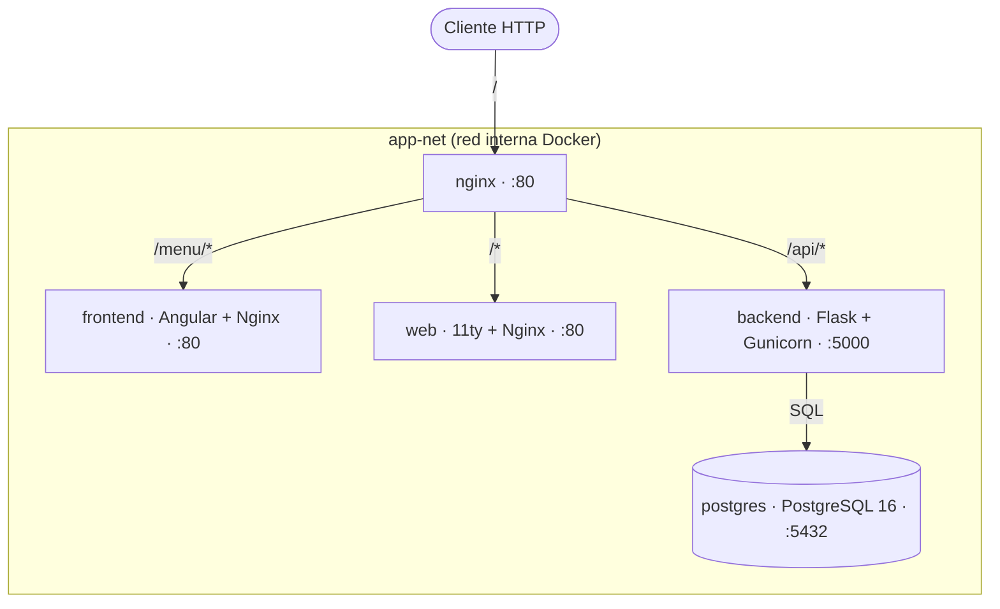
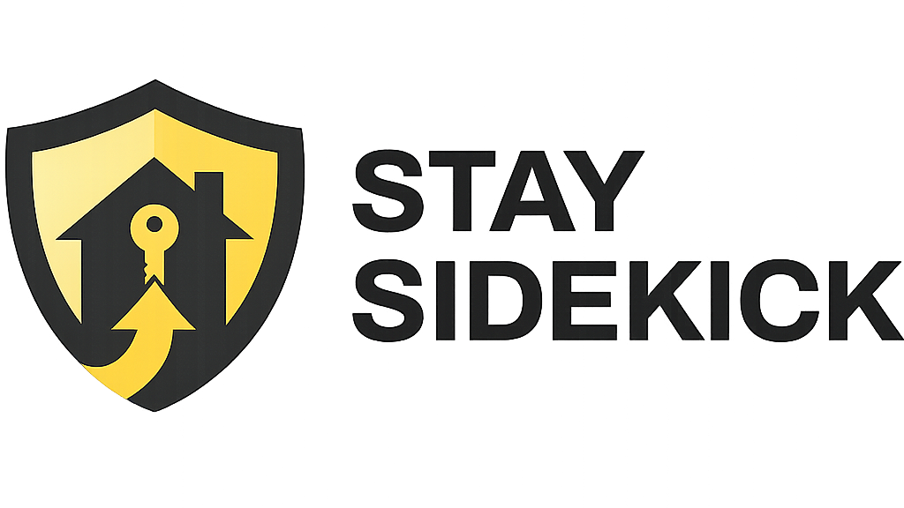

# Stay Sidekick


[](https://github.com/sdurutr436/stay-sidekick/actions/workflows/ci-python.yml)
[](https://github.com/sdurutr436/stay-sidekick/actions/workflows/ci-angular.yml)
[](https://github.com/sdurutr436/stay-sidekick/actions/workflows/ci-angular-tests.yml)
[](https://github.com/sdurutr436/stay-sidekick/actions/workflows/ci-web.yml)

Stay Sidekick es una plataforma web para equipos de alojamiento turístico que agrupa, en un mismo stack, una landing pública, un panel de trabajo privado y una API REST para operaciones como gestión de solicitudes, herramientas multiempresa, sincronización de contactos y automatizaciones de apoyo.

- Producción pública: [stay-sidekick.up.railway.app](https://stay-sidekick.up.railway.app)
- Imágenes publicadas: [Docker Hub - sdurutr436](https://hub.docker.com/u/sdurutr436)

## Qué incluye

- `web/`: sitio estático con contenido público, legal y corporativo.
- `frontend/`: SPA Angular para el panel operativo.
- `backend/`: API REST Flask para autenticación, negocio y notificaciones.
- `nginx/`: proxy inverso que publica `/`, `/menu/` y `/api/` en una única entrada.

## Arquitectura

| Capa | Tecnología | Puerto | Descripción |
|------|------------|--------|-------------|
| `web/` | [11ty](https://www.11ty.dev/) + Nunjucks | `8080` | Sitio estático público |
| `frontend/` | [Angular](https://angular.dev/) | `4200` | Panel privado y herramientas |
| `backend/` | [Flask](https://flask.palletsprojects.com/) | `5000` | API REST y lógica de negocio |
| `nginx/` | Nginx | `80` | Entrada única y enrutado por prefijos |

Los estilos SCSS se comparten entre `web/` y `frontend/` desde `frontend/src/styles/`, con una organización ITCSS y nomenclatura BEM para mantener consistencia visual entre el sitio público y la SPA.


```mermaid
graph TD
    Cliente(["Cliente HTTP"])

    subgraph app_net["app-net (red interna Docker)"]
        Nginx["nginx · :80"]
        Frontend["frontend · Angular + Nginx · :80"]
        Web["web · 11ty + Nginx · :80"]
        Backend["backend · Flask + Gunicorn · :5000"]
        Postgres[("postgres · PostgreSQL 16 · :5432")]
    end

    Cliente -->|"/"| Nginx
    Nginx -->|"/api/*"| Backend
    Nginx -->|"/menu/*"| Frontend
    Nginx -->|"/*"| Web
    Backend -->|"SQL"| Postgres
```

## Stack técnico

| Área | Stack real del repositorio |
|------|----------------------------|
| Sitio público | 11ty, Nunjucks, Sass |
| Aplicación | Angular 21 |
| Backend | Flask, Gunicorn, PostgreSQL |
| Infraestructura | Docker Compose, Railway, Nginx |
| Calidad | GitHub Actions, Ruff, Pytest, Angular build y tests |

## Inicio rápido

### Requisitos

- Node.js 18 o superior
- npm 10 o superior
- Python 3.12
- Docker 24+ si quieres levantar el stack completo

### Sitio público y SPA en desarrollo

Linux o macOS:

```bash
chmod +x dev.sh
./dev.sh
```

Windows:

```bat
dev.bat
```

Alternativa directa con npm:

```bash
npm install
npm run dev
```

Esto deja disponibles:

- `http://localhost:8080` para el sitio estático.
- `http://localhost:4200` para la SPA Angular.

### Arranque por servicio

```bash
npm run dev:web
npm run dev:app
cd backend && python run.py
```

La preparación del entorno virtual Python está documentada en [docs/backend/VENV_SETUP.md](docs/backend/VENV_SETUP.md).

### Instalar dependencias Node de una vez

```bash
npm run install:all
```

### Stack completo con Docker

Primer uso:

```bash
cp .env.example .env
cp backend/.env.example backend/.env
```

Arranque:

```bash
docker compose up --build
docker compose up -d --build
```

URLs disponibles tras el arranque:

| URL | Servicio |
|-----|----------|
| `http://localhost/` | Sitio público 11ty |
| `http://localhost/menu/` | SPA Angular |
| `http://localhost/api/` | API Flask |

Credenciales de desarrollo sembradas por el seed local:

| Campo | Valor |
|-------|-------|
| Email | `dev@staysidekick.es` |
| Contraseña | `admin123` |
| Rol | `superadmin` |

La referencia completa de despliegue, variables y verificación está en [DEPLOY.md](DEPLOY.md) y [docs/devops/docker-local.md](docs/devops/docker-local.md).

## Demo y material visual



El repositorio ya incluye placeholders para la entrega pública de capturas en [docs/assets/despliegue-web](docs/assets/despliegue-web). Mientras no se sustituyan por evidencias finales, se mantienen como referencia honesta del material pendiente:

| Ruta esperada | Captura pendiente |
|---------------|-------------------|
| `docs/assets/despliegue-web/01-github-actions-general-placeholder.svg` | Vista general de GitHub Actions con los workflows principales en verde |
| `docs/assets/despliegue-web/02-github-actions-run-verde-placeholder.svg` | Detalle de un run correcto de CI/CD |
| `docs/assets/despliegue-web/03-docker-compose-ps-placeholder.svg` | Salida de `docker compose ps` con los servicios levantados |
| `docs/assets/despliegue-web/04-docker-hub-tags-placeholder.svg` | Repositorio de Docker Hub con tags publicados |
| `docs/assets/despliegue-web/05-railway-servicios-placeholder.svg` | Dashboard de Railway con servicios y dominio público |


## Estructura del proyecto

```text
stay-sidekick/
├── backend/      # API Flask y módulos funcionales
├── frontend/     # SPA Angular
├── web/          # Sitio estático 11ty
├── nginx/        # Proxy inverso y rutas públicas
├── docs/         # Documentación técnica y funcional
├── package.json  # Orquestador de desarrollo
├── dev.sh        # Inicio rápido Linux/macOS
└── dev.bat       # Inicio rápido Windows
```

## Documentación

| Documento | Contenido |
|-----------|-----------|
| [DEPLOY.md](DEPLOY.md) | Despliegue local y producción en Railway |
| [docs/01-introduccion.md](docs/01-introduccion.md) a [docs/10-conclusiones.md](docs/10-conclusiones.md) | Memoria técnica principal del proyecto |
| [docs/DESARROLLO.md](docs/DESARROLLO.md) | Guía de entorno y flujo de trabajo |
| [docs/backend/DEPENDENCIAS.md](docs/backend/DEPENDENCIAS.md) | Dependencias del backend y justificación |
| [docs/backend/VENV_SETUP.md](docs/backend/VENV_SETUP.md) | Entorno virtual Python |
| [docs/design/decisiones_disenio.md](docs/design/decisiones_disenio.md) | Decisiones de diseño y arquitectura |
| [docs/propuesta_formal/propuesta_formal_sergio_duran_2DAW.md](docs/propuesta_formal/propuesta_formal_sergio_duran_2DAW.md) | Propuesta formal del proyecto |

## Colaboración y mantenimiento

- [CONTRIBUTING.md](CONTRIBUTING.md)
- [CODE_OF_CONDUCT.md](CODE_OF_CONDUCT.md)
- [SECURITY.md](SECURITY.md)
- [LICENSE](LICENSE)
