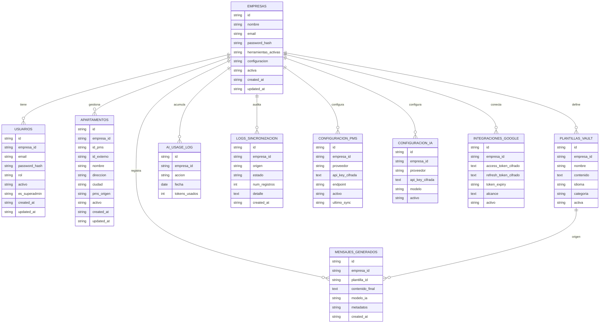
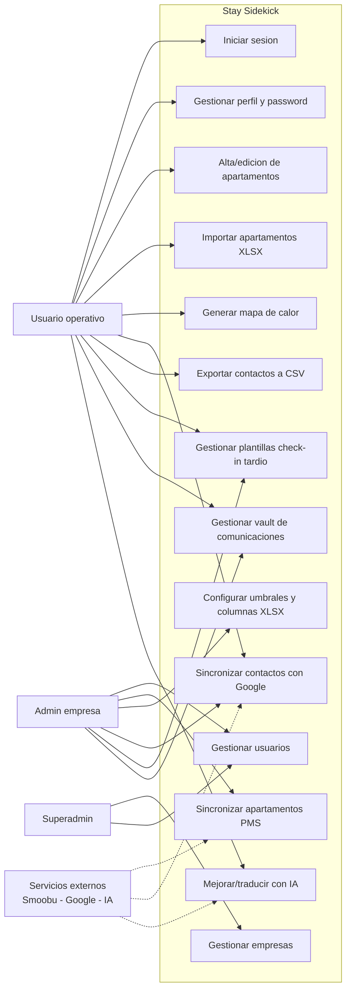
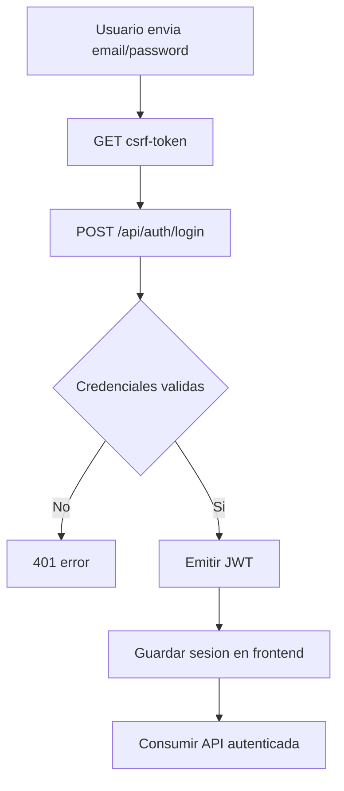
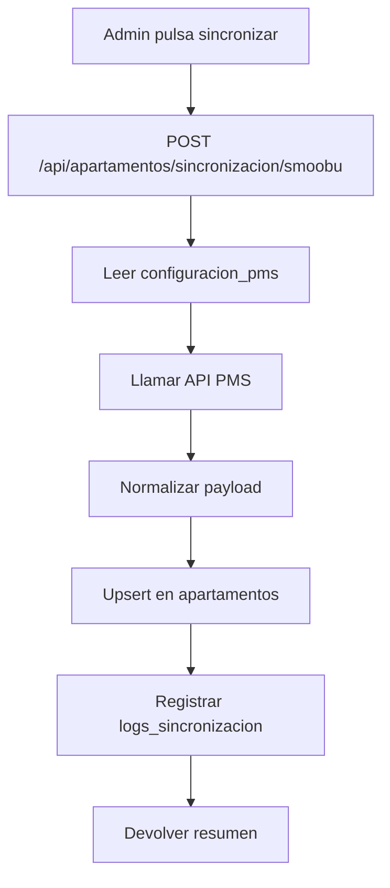
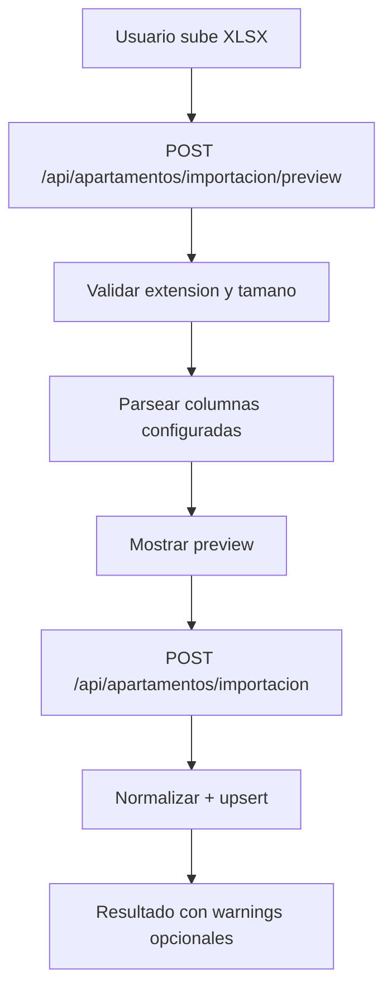
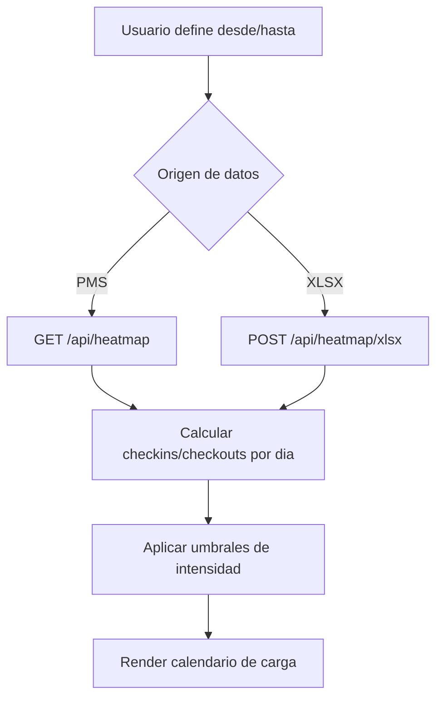
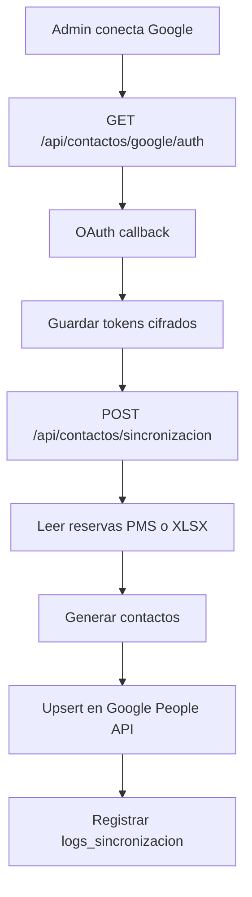
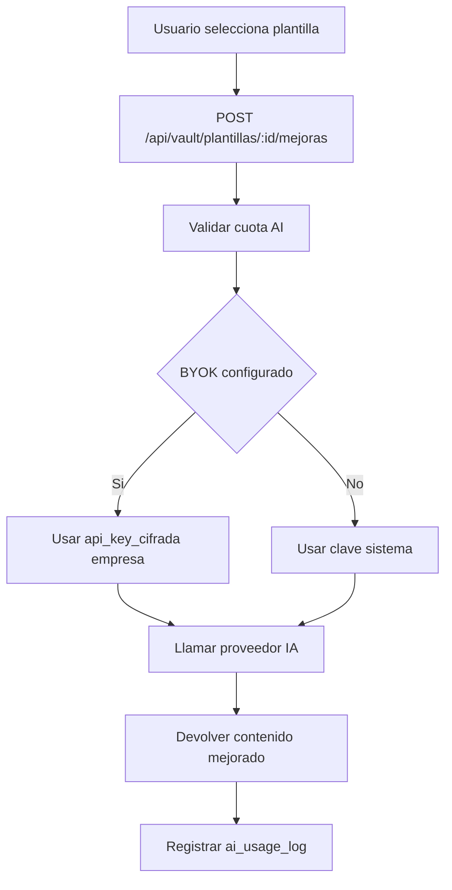
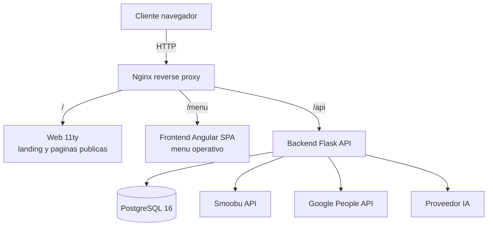

# 5. Diseno

## Indice

- [5.1. Diagrama entidad-relacion](#51-diagrama-entidad-relacion)
  - [Entidades y atributos principales](#entidades-y-atributos-principales)
  - [Relaciones](#relaciones)
- [5.2. Diagrama de casos de uso](#52-diagrama-de-casos-de-uso)
- [5.3. Diagramas de flujo de los procesos principales](#53-diagramas-de-flujo-de-los-procesos-principales)
  - [Flujo 1 - Inicio de sesion](#flujo-1---inicio-de-sesion)
  - [Flujo 2 - Sincronizar apartamentos desde PMS](#flujo-2---sincronizar-apartamentos-desde-pms)
  - [Flujo 3 - Importar apartamentos desde XLSX](#flujo-3---importar-apartamentos-desde-xlsx)
  - [Flujo 4 - Generar mapa de calor](#flujo-4---generar-mapa-de-calor)
  - [Flujo 5 - Sincronizar contactos con Google](#flujo-5---sincronizar-contactos-con-google)
  - [Flujo 6 - Mejorar plantilla en Vault con IA](#flujo-6---mejorar-plantilla-en-vault-con-ia)
- [5.4. Arquitectura de la aplicacion](#54-arquitectura-de-la-aplicacion)
  - [Vision general](#vision-general)
  - [Capa frontend](#capa-frontend)
  - [Capa backend](#capa-backend)
  - [Capa de datos](#capa-de-datos)
  - [Integraciones externas](#integraciones-externas)
- [5.5. Diseno de la API](#55-diseno-de-la-api)
  - [Convenciones generales](#convenciones-generales)
  - [Modulos de endpoints](#modulos-de-endpoints)
  - [Ejemplos de respuestas](#ejemplos-de-respuestas)

---

## 5.1. Diagrama entidad-relacion

El modelo de datos esta orientado a multiempresa. Cada empresa dispone de su propio espacio de configuracion, usuarios, apartamentos, plantillas e integraciones, con aislamiento logico por `empresa_id`.



### Entidades y atributos principales

- `empresas`: cuenta principal por cliente, activacion de herramientas y configuracion operativa.
- `usuarios`: miembros de equipo con roles `admin` u `operativo`; soporta `es_superadmin`.
- `apartamentos`: maestro de alojamientos con origen (`smoobu`, `beds24`, `manual`, `xlsx`).
- `configuracion_pms`: proveedor y credenciales cifradas del PMS por empresa.
- `integraciones_google`: tokens OAuth cifrados para sincronizacion de contactos.
- `configuracion_ia`: proveedor/modelo y API key BYOK cifrada.
- `plantillas_vault`: biblioteca de mensajes reutilizables por categoria e idioma.
- `mensajes_generados`: trazabilidad de resultados de IA sobre plantillas.
- `logs_sincronizacion`: auditoria de procesos de sincronizacion.
- `ai_usage_log`: consumo diario de IA para control de cuotas.

### Relaciones

- Una empresa tiene N usuarios, N apartamentos, N plantillas y N logs.
- Una empresa tiene 0..1 configuracion PMS, 0..1 configuracion IA y 0..1 integracion Google.
- Una plantilla puede originar N mensajes generados.
- Todas las tablas funcionales usan `empresa_id` para aislamiento multi-tenant.

---

## 5.2. Diagrama de casos de uso



Actores principales:

- Usuario operativo: usa herramientas diarias del panel.
- Admin de empresa: administra equipo, integraciones y configuraciones.
- Superadmin: administra empresas y operaciones globales.
- Servicios externos: PMS, Google Contacts y proveedor de IA.

---

## 5.3. Diagramas de flujo de los procesos principales

### Flujo 1 - Inicio de sesion



### Flujo 2 - Sincronizar apartamentos desde PMS



### Flujo 3 - Importar apartamentos desde XLSX



### Flujo 4 - Generar mapa de calor



### Flujo 5 - Sincronizar contactos con Google



### Flujo 6 - Mejorar plantilla en Vault con IA



---

## 5.4. Arquitectura de la aplicacion

### Vision general

La aplicacion sigue arquitectura cliente-servidor con proxy inverso y separacion por capas: sitio web publico, SPA autenticada, API backend y base de datos relacional.



### Capa frontend

- Angular SPA para zona autenticada (`/menu`).
- Sitio 11ty para contenido publico (`/`).
- Consumo API via JSON y multipart.
- Gestion de sesion con JWT y token CSRF en operaciones de escritura.

### Capa backend

- Flask con blueprints modulares (`auth`, `perfil`, `usuarios`, `empresas`, `apartamentos`, `contactos`, `notificaciones`, `vault`, `heatmap`, `contacto`).
- Seguridad: JWT, CSRF double-submit cookie, rate limiting, CORS.
- Logica de negocio por herramientas del MVP.

### Capa de datos

- PostgreSQL con UUID como claves primarias.
- Cifrado de secretos en BD mediante Fernet.
- Tablas de auditoria para sincronizaciones y uso de IA.
- Modelo preparado para multi-tenant por `empresa_id`.

### Integraciones externas

- PMS (Smoobu en MVP) para apartamentos y reservas.
- Google OAuth + People API para sincronizacion de contactos.
- Proveedor IA (Gemini/OpenAI/Claude) para mejoras y traducciones en Vault.

---

## 5.5. Diseno de la API

### Convenciones generales

- Base path: `/api`.
- Auth: `Authorization: Bearer <JWT>` en endpoints privados.
- CSRF: `X-CSRF-Token` + cookie en endpoints de escritura.
- Respuestas exitosas estandar: `{"ok": true, ...}`.
- Respuestas de error estandar: `{"ok": false, "errors": ["..."]}`.
- Codigos frecuentes: `200`, `201`, `400`, `401`, `403`, `404`, `409`, `413`, `422`, `429`, `502`, `504`.

### Modulos de endpoints

| Modulo | Endpoints principales |
|---|---|
| Salud y docs | `GET /api/health`, `GET /api/docs`, `GET /api/docs/openapi.yaml` |
| Autenticacion | `GET /api/csrf-token`, `POST /api/auth/login`, `GET /api/auth/validacion` |
| Perfil e integraciones | `GET /api/perfil`, `PUT /api/perfil/password`, `GET/PUT/DELETE /api/perfil/integraciones/*` |
| Empresas | `GET/POST /api/empresas` (superadmin) |
| Usuarios | `GET/POST /api/usuarios`, `PATCH/DELETE /api/usuarios/:id` |
| Maestro apartamentos | `GET/POST/PUT/DELETE /api/apartamentos`, `POST /api/apartamentos/sincronizacion/smoobu`, importacion XLSX |
| Contactos | OAuth Google, preferencias, sincronizacion y export CSV (`/api/contactos/*`) |
| Notificaciones tardias | `GET /status`, `POST /checkins`, CRUD de plantillas check-in tardio |
| Vault comunicaciones | CRUD plantillas, `mejoras`, `traducciones`, uso y config IA |
| Mapa de calor | `GET /api/heatmap`, `POST /api/heatmap/xlsx`, `GET/PUT /umbrales`, `GET/PUT /config-xlsx` |
| Contacto publico | `POST /api/contacto`, `POST /api/contact` |

### Ejemplos de respuestas

Login correcto:

```json
{
  "ok": true,
  "token": "<jwt>",
  "debe_cambiar_password": false
}
```

Validacion fallida:

```json
{
  "ok": false,
  "errors": [
    "El campo email es obligatorio."
  ]
}
```

Respuesta tipica de modulo:

```json
{
  "ok": true,
  "resultado": {
    "creados": 12,
    "actualizados": 7,
    "omitidos": 1
  }
}
```
