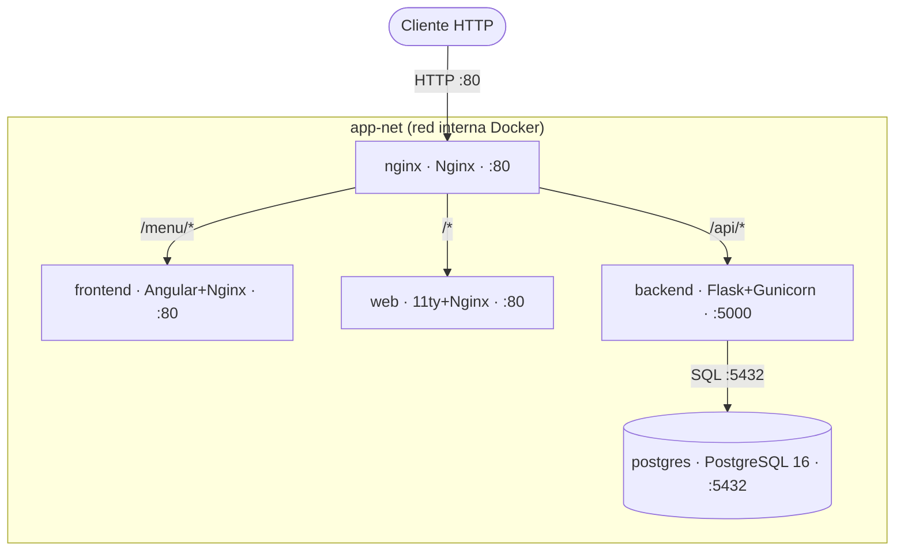

# 08. Despliegue de la aplicación web

> Documento adicional para la evaluación del módulo de Despliegue de Aplicaciones Web.
> No sustituye a [08-despliegue.md](08-despliegue.md): lo complementa con evidencias directas alineadas con la rúbrica (`c1` a `c6`, `C7` y `C8`).

---

## Índice

- [c6 — Documentación del proyecto](#c6--documentación-del-proyecto)
- [c5 — Control de versiones y CI/CD](#c5--control-de-versiones-y-cicd)
- [c1 — Arquitectura de la aplicación](#c1--arquitectura-de-la-aplicación)
- [c2 — Implementación en Docker](#c2--implementación-en-docker)
- [c3 — Servidor web como front (reverse proxy)](#c3--servidor-web-como-front-reverse-proxy)
- [c4 — Servidor de aplicaciones (backend)](#c4--servidor-de-aplicaciones-backend)
- [C7 — Gestión de ficheros y artefactos](#c7--gestión-de-ficheros-y-artefactos)
- [C8 — Verificación de red del despliegue](#c8--verificación-de-red-del-despliegue)

---

## c6 — Documentación del proyecto

### Qué es Stay Sidekick

Stay Sidekick es una plataforma web satélite para operaciones del alquiler vacacional. No sustituye al PMS; añade herramientas operativas que normalmente están dispersas o no existen en los PMS generalistas: maestro de apartamentos, mapa de calor, notificaciones de check-in tardío, sincronización de contactos y vault de comunicaciones con asistencia IA.

### Estructura de documentación del repositorio

| Fichero / carpeta | Contenido |
| --- | --- |
| [README.md](../README.md) | Qué hace el proyecto, arquitectura Docker, arranque rápido, credenciales dev y enlaces a documentación |
| [DEPLOY.md](../DEPLOY.md) | Despliegue local y Railway, variables de entorno, verificación y troubleshooting |
| [docs/08-despliegue.md](08-despliegue.md) | Capítulo general de despliegue para la memoria del TFG |
| [docs/api/endpoints.md](api/endpoints.md) | API REST con endpoints, parámetros, códigos y ejemplos `curl` |
| [docs/railway_deployment.md](railway_deployment.md) | Procedimiento detallado de despliegue en Railway |
| Este fichero | Evidencias específicas para la rúbrica del módulo de despliegue |

### API documentada con ejemplos reales

La API queda documentada por dos vías complementarias:

- guía manual operativa en [docs/api/endpoints.md](api/endpoints.md)
- especificación OpenAPI en [backend/app/docs/openapi.yaml](../backend/app/docs/openapi.yaml)

Ejemplos reales de verificación local:

```bash
# Healthcheck público vía proxy
curl -s http://localhost/api/health
# {"status":"ok"}

# Ruta protegida sin JWT
curl -i -s http://localhost/api/usuarios
# HTTP/1.1 401 UNAUTHORIZED
# {"errors":["Token de acceso requerido."],"ok":false}
```

Esto evidencia que la documentación no es solo descriptiva: permite probar endpoints reales con comandos reproducibles.

---

## c5 — Control de versiones y CI/CD

### Uso de Git y ramas

El repositorio mantiene `main` como rama estable y utiliza ramas temáticas para trabajo incremental. En el historial del proyecto se observan ramas `dev-*`, `fix-*`, `docs-*` y ramas de refactor por dominio.

Extracto real de ramas presentes en el repositorio:

```text
dev-herramientas
docs-documentacion-final
main
remotes/origin/dev-dashboard
remotes/origin/dev-mapa-calor
remotes/origin/dev-vault-comunicaciones
remotes/origin/fix-csp-turnstile
remotes/origin/fix-smoobu-backend
remotes/origin/refactor-entidad-usuarios
```

Extracto real del historial reciente:

```text
8978a11 docs: agregar sección de conclusiones con evaluación crítica, cumplimiento de objetivos y lecciones aprendidas
1ba2af9 docs: agregar manual de usuario con secciones detalladas y guías de uso
27d529f docs: agregar sección de despliegue con estrategia, arquitectura y configuración de CI/CD
96acfd4 merge: fix-python-3.12-alignment -> docs-documentacion-final; alinea backend y documentación con Python 3.12
```

### Workflows de GitHub Actions

El proyecto separa la integración continua por stack:

| Workflow | Fichero | Función |
| --- | --- | --- |
| CI Python | [.github/workflows/ci-python.yml](../.github/workflows/ci-python.yml) | `ruff` + `pytest` con `postgres:16-alpine` como servicio |
| CI Angular tests | [.github/workflows/ci-angular-tests.yml](../.github/workflows/ci-angular-tests.yml) | Tests frontend con Vitest y artefacto de cobertura |
| CI Angular | [.github/workflows/ci-angular.yml](../.github/workflows/ci-angular.yml) | Build de producción Angular |
| CI 11ty | [.github/workflows/ci-web.yml](../.github/workflows/ci-web.yml) | Build del sitio estático |
| Docker Hub | [.github/workflows/docker-publish.yml](../.github/workflows/docker-publish.yml) | Publicación de imágenes tras éxito de los tres CI |

Snippet real de CI Python:

```yaml
services:
  postgres:
    image: postgres:16-alpine
    env:
      POSTGRES_DB: stay_sidekick
      POSTGRES_USER: postgres
      POSTGRES_PASSWORD: postgres

steps:
  - name: Instalar dependencias
    run: pip install -r backend/requirements.txt pytest
  - name: Ejecutar tests
    run: pytest backend/tests/ -v
```

Snippet real de publicación Docker condicionada:

```yaml
on:
  workflow_run:
    workflows: [CI Angular, CI 11ty, CI Python]
    types: [completed]
    branches: [main]

jobs:
  publicar:
    needs: verificar
    if: needs.verificar.outputs.todos-pasaron == 'true'
```

Secrets usados en CD:

- `DOCKERHUB_USERNAME`
- `DOCKERHUB_TOKEN`
- `TURNSTILE_SITE_KEY`

Placeholders de capturas para evidenciar runs en verde:


---

## c1 — Arquitectura de la aplicación

### Diagrama de servicios y comunicaciones



### Descripción de servicios

| Servicio | Evidencia | Puerto | Rol |
| --- | --- | --- | --- |
| `nginx` | [docker-compose.yml](../docker-compose.yml), [nginx/nginx.conf](../nginx/nginx.conf) | `80` público | Punto único de entrada, reverse proxy y cabeceras de seguridad |
| `frontend` | [frontend/Dockerfile](../frontend/Dockerfile) | `80` interno | SPA Angular |
| `web` | [web/Dockerfile](../web/Dockerfile) | `80` interno | Sitio estático 11ty |
| `backend` | [backend/Dockerfile](../backend/Dockerfile) | `5000` interno | API Flask y lógica de negocio |
| `postgres` | [docker-compose.yml](../docker-compose.yml) | `5432` interno | Persistencia relacional |

Snippet real de la orquestación:

```yaml
nginx:
  ports:
    - "80:80"

backend:
  expose:
    - "5000"
  depends_on:
    postgres:
      condition: service_healthy

postgres:
  image: postgres:16-alpine
  expose:
    - "5432"
```

La separación es clara: solo se expone `nginx`, mientras que backend y base de datos quedan en red interna. Esto cumple el criterio de arquitectura por servicios diferenciados y comunicación interna explícita.

---

## c2 — Implementación en Docker

### Ficheros principales de despliegue reproducible

| Elemento | Ruta |
| --- | --- |
| Orquestación | [docker-compose.yml](../docker-compose.yml) |
| Variables raíz | [.env.example](../.env.example) |
| Variables backend | [backend/.env.example](../backend/.env.example) |
| Imagen backend | [backend/Dockerfile](../backend/Dockerfile) |
| Imagen frontend | [frontend/Dockerfile](../frontend/Dockerfile) |
| Imagen web | [web/Dockerfile](../web/Dockerfile) |
| Imagen nginx | [nginx/Dockerfile](../nginx/Dockerfile) |

### Arranque reproducible desde cero

```bash
cp .env.example .env
cp backend/.env.example backend/.env
docker compose up -d --build
docker compose ps
```

### Salida real de `docker compose ps`

```text
NAME                       IMAGE                    COMMAND                  SERVICE    STATUS                    PORTS
stay-sidekick-backend-1    stay-sidekick-backend    "/bin/sh -c 'flask d…"   backend    Up 7 seconds              5000/tcp
stay-sidekick-frontend-1   stay-sidekick-frontend   "/docker-entrypoint.…"   frontend   Up 13 seconds             80/tcp
stay-sidekick-nginx-1      stay-sidekick-nginx      "/docker-entrypoint.…"   nginx      Up 6 seconds              0.0.0.0:80->80/tcp, [::]:80->80/tcp
stay-sidekick-postgres-1   postgres:16-alpine       "docker-entrypoint.s…"   postgres   Up 13 seconds (healthy)   5432/tcp
stay-sidekick-web-1        stay-sidekick-web        "/docker-entrypoint.…"   web        Up 13 seconds             80/tcp
```

Esto demuestra:

- despliegue reproducible con Compose
- un único puerto público (`80`)
- base de datos con `healthcheck`
- backend, frontend y web accesibles por red interna

Placeholders de captura para la evidencia visual:


### Imágenes y artefactos locales generados

Salida real de `docker compose images`:

```text
CONTAINER                  REPOSITORY               TAG         IMAGE ID       SIZE
stay-sidekick-backend-1    stay-sidekick-backend    latest      5c3857e918c3   184MB
stay-sidekick-frontend-1   stay-sidekick-frontend   latest      079bfc2ef05b   36MB
stay-sidekick-nginx-1      stay-sidekick-nginx      latest      3c31d3fbdd83   25.9MB
stay-sidekick-postgres-1   postgres                 16-alpine   a5074487380d   110MB
stay-sidekick-web-1        stay-sidekick-web        latest      9d3fa9e61f22   35.8MB
```

En remoto, el workflow de CD publica imágenes en Docker Hub usando el usuario configurado en `DOCKERHUB_USERNAME`, con nombres `stay-sidekick-backend`, `stay-sidekick-frontend`, `stay-sidekick-web` y `stay-sidekick-nginx`.

---

## c3 — Servidor web como front (reverse proxy)

### Configuración relevante del proxy

Fichero: [nginx/nginx.conf](../nginx/nginx.conf)

```nginx
location /api/ {
    proxy_pass         http://backend_upstream;
    proxy_set_header   Host              $host;
    proxy_set_header   X-Real-IP         $remote_addr;
    proxy_set_header   X-Forwarded-For   $proxy_add_x_forwarded_for;
    proxy_set_header   X-Forwarded-Proto $scheme;
}

location /menu {
    rewrite ^/menu/?(.*)$ /$1 break;
    proxy_pass         http://frontend_upstream;
}

location / {
    proxy_intercept_errors on;
    proxy_pass         http://web_upstream;
}
```

Esto evidencia que `nginx` actúa como front real:

- sirve el sitio estático en `/`
- envía la SPA Angular a `/menu`
- proxy-pasa la API a `/api`
- añade cabeceras de seguridad (`X-Frame-Options`, `X-Content-Type-Options`, `Referrer-Policy`, `Content-Security-Policy`)

### Comprobaciones reales con `curl`

Front:

```bash
curl -I -s http://localhost/
```

```text
HTTP/1.1 200 OK
Server: nginx/1.29.4
Content-Type: text/html
X-Frame-Options: SAMEORIGIN
X-Content-Type-Options: nosniff
Referrer-Policy: strict-origin-when-cross-origin
Content-Security-Policy: default-src 'self'; ...
```

API protegida a través del proxy:

```bash
curl -i -s http://localhost/api/usuarios
```

```text
HTTP/1.1 401 UNAUTHORIZED
Server: nginx/1.29.4
Content-Type: application/json

{"errors":["Token de acceso requerido."],"ok":false}
```

La respuesta `401` en JSON prueba que la petición entra por `nginx`, atraviesa el reverse proxy y es respondida por Flask, no por un `404` HTML local.

### Logs reales del proxy

```bash
docker compose logs --tail=5 nginx
```

```text
nginx-1  | 172.18.0.1 - - [15/May/2026:18:03:49 +0000] "HEAD / HTTP/1.1" 200 0 "-" "PowerShell/7.5.5" "-"
nginx-1  | 172.18.0.1 - - [15/May/2026:18:03:51 +0000] "GET /api/health HTTP/1.1" 200 16 "-" "PowerShell/7.5.5" "-"
nginx-1  | 172.18.0.1 - - [15/May/2026:18:03:51 +0000] "GET /api/usuarios HTTP/1.1" 401 53 "-" "PowerShell/7.5.5" "-"
```

En producción, el dominio público se sirve mediante Railway (`https://staysidekick.up.railway.app`), que proporciona HTTPS en el borde y reenvía al servicio `nginx`.

---

## c4 — Servidor de aplicaciones (backend)

### Evidencia del servidor de aplicaciones

Fichero: [backend/Dockerfile](../backend/Dockerfile)

```dockerfile
CMD flask db upgrade && gunicorn --bind "[::]:${PORT:-5000}" --workers 2 run:app
```

Esto demuestra que el backend no corre con el servidor de desarrollo de Flask, sino con Gunicorn, que es adecuado como servidor de aplicaciones para despliegue.

Comando real del proceso principal dentro del contenedor:

```bash
docker compose exec backend sh -lc "tr '\0' ' ' </proc/1/cmdline"
```

```text
/bin/sh -c flask db upgrade && gunicorn --bind "[::]:${PORT:-5000}" --workers 2 run:app
```

### Healthcheck implementado en la aplicación

Fichero: [backend/app/__init__.py](../backend/app/__init__.py)

```python
@app.route("/api/health")
def health():
    return jsonify({"status": "ok"}), 200
```

Comprobación real:

```bash
curl -s http://localhost/api/health
```

```text
{"status":"ok"}
```

### Prueba ligera de funcionamiento y respuesta

Se lanzó una prueba simple de 20 peticiones consecutivas al endpoint `/api/health`:

```powershell
$sw = [System.Diagnostics.Stopwatch]::StartNew()
1..20 | ForEach-Object { Invoke-RestMethod -Uri 'http://localhost/api/health' | Out-Null }
$sw.Stop()
```

Resultado real:

```text
Requests : 20
TotalMs  : 97,38
AvgMs    : 4,87
```

Interpretación: para una carga ligera local, el backend respondió de forma consistente y sin errores, con una media inferior a 5 ms por petición al healthcheck.

### Logs del backend

```bash
docker compose logs --tail=5 backend
```

```text
backend-1  | 2026-05-15 18:03:50,182 [DEBUG] LiteLLM: Using AiohttpTransport...
backend-1  | 18:03:50 - LiteLLM:DEBUG: http_handler.py:862 - Creating AiohttpTransport...
backend-1  | 2026-05-15 18:03:50,182 [DEBUG] LiteLLM: Creating AiohttpTransport...
```

Aunque el extracto mostrado pertenece a inicialización del cliente IA, evidencia que el backend está generando logs operativos dentro del contenedor y que la aplicación está viva.

---

## C7 — Gestión de ficheros y artefactos

### Inventario de artefactos relevantes del despliegue

| Artefacto | Ruta | Se versiona | Uso |
| --- | --- | :---: | --- |
| Compose | [docker-compose.yml](../docker-compose.yml) | Sí | Define servicios, red, volúmenes y puertos |
| Variables raíz | [.env.example](../.env.example) | Sí | Plantilla para PostgreSQL y `DATABASE_URL` |
| Variables backend | [backend/.env.example](../backend/.env.example) | Sí | Plantilla para Flask, JWT, Google, Gmail, Discord, IA y Smoobu |
| Variables reales | `.env`, `backend/.env` | No | Secretos del entorno local o productivo |
| Dockerfiles | [backend/Dockerfile](../backend/Dockerfile), [frontend/Dockerfile](../frontend/Dockerfile), [web/Dockerfile](../web/Dockerfile), [nginx/Dockerfile](../nginx/Dockerfile) | Sí | Generan las imágenes del stack |
| Config del proxy | [nginx/nginx.conf](../nginx/nginx.conf) | Sí | Enrutado y cabeceras del front |
| Workflows | [.github/workflows](../.github/workflows) | Sí | CI/CD y publicación de imágenes |
| Volumen persistente | `postgres_data` | Se crea localmente | Conserva datos de PostgreSQL entre reinicios |

### Evidencia de gestión correcta de secretos

Salida real de comprobación:

```bash
git check-ignore -v .env
git ls-files .env
```

```text
.gitignore:79:.env      .env
```

La ausencia de salida en `git ls-files .env` confirma que el archivo real de secretos no está versionado.

### Evidencia de volúmenes persistentes

```bash
docker volume ls --filter name=stay-sidekick
```

```text
DRIVER    VOLUME NAME
local     stay-sidekick_postgres_data
```

En el despliegue actual, el volumen persistente esencial es `postgres_data`, donde se conserva la base de datos completa.

### Evidencia de imágenes generadas

Además de las imágenes locales del `docker compose images`, el workflow `docker-publish.yml` construye y publica cuatro imágenes con SHA corto:

- `stay-sidekick-backend`
- `stay-sidekick-frontend`
- `stay-sidekick-web`
- `stay-sidekick-nginx`

Placeholders de capturas recomendadas para evaluación:


---

## C8 — Verificación de red del despliegue

### URLs, puertos y servicio que responde

| URL / ruta | Puerto | Servicio que responde | Qué se comprueba |
| --- | --- | --- | --- |
| `http://localhost/` | `80` | `nginx` -> `web` | Acceso al front público |
| `http://localhost/menu/` | `80` | `nginx` -> `frontend` | Acceso a la SPA Angular |
| `http://localhost/api/health` | `80` | `nginx` -> `backend` | Healthcheck de la API vía proxy |
| `http://localhost/api/usuarios` | `80` | `nginx` -> `backend` | Ruta protegida y control de acceso |
| `https://staysidekick.up.railway.app` | `443` | Railway -> `nginx` | Dominio público en producción |

### Estado y puertos publicados

La salida real de `docker compose ps` muestra que solo `nginx` expone un puerto al host:

```text
stay-sidekick-nginx-1      stay-sidekick-nginx      Up 6 seconds              0.0.0.0:80->80/tcp, [::]:80->80/tcp
stay-sidekick-backend-1    stay-sidekick-backend    Up 7 seconds              5000/tcp
stay-sidekick-postgres-1   postgres:16-alpine       Up 13 seconds (healthy)   5432/tcp
```

Interpretación: el host entra por `80`, mientras backend y PostgreSQL permanecen solo en la red Docker interna.

### Pruebas reproducibles con `curl`

Front:

```bash
curl -I -s http://localhost/
```

```text
HTTP/1.1 200 OK
Server: nginx/1.29.4
Content-Type: text/html
```

Backend a través del proxy:

```bash
curl -s http://localhost/api/health
```

```text
{"status":"ok"}
```

Ruta protegida:

```bash
curl -i -s http://localhost/api/usuarios
```

```text
HTTP/1.1 401 UNAUTHORIZED
{"errors":["Token de acceso requerido."],"ok":false}
```

### Comunicación interna entre servicios

```bash
docker network ls --filter name=stay-sidekick
docker network inspect stay-sidekick_app-net --format '{{range .Containers}}{{.Name}} {{.IPv4Address}}{{println}}{{end}}'
```

```text
NETWORK ID     NAME                    DRIVER    SCOPE
400435ca2c46   stay-sidekick_app-net   bridge    local

stay-sidekick-postgres-1 172.18.0.3/16
stay-sidekick-backend-1 172.18.0.5/16
stay-sidekick-web-1 172.18.0.4/16
stay-sidekick-frontend-1 172.18.0.2/16
stay-sidekick-nginx-1 172.18.0.6/16
```

Esto confirma que los cinco contenedores comparten la misma red bridge y se comunican por nombre de servicio.

### Verificación del aislamiento

El backend y PostgreSQL no deben responder directamente desde el host:

```bash
curl -s -o NUL -w "%{http_code}" --max-time 2 http://localhost:8080/api/health
curl -s -o NUL -w "%{http_code}" --max-time 2 http://localhost:5432
```

```text
000
000
```

El código `000` demuestra que no hay publicación directa de esos puertos hacia el host, por lo que el único punto de entrada es el proxy `nginx`.

---

## Capturas pendientes para “excelente”

Las capturas recomendadas para redondear la evaluación visual están en [docs/assets/despliegue-web/README.md](assets/despliegue-web/README.md). Se han dejado placeholders SVG para no romper el documento mientras se sustituyen por capturas reales.