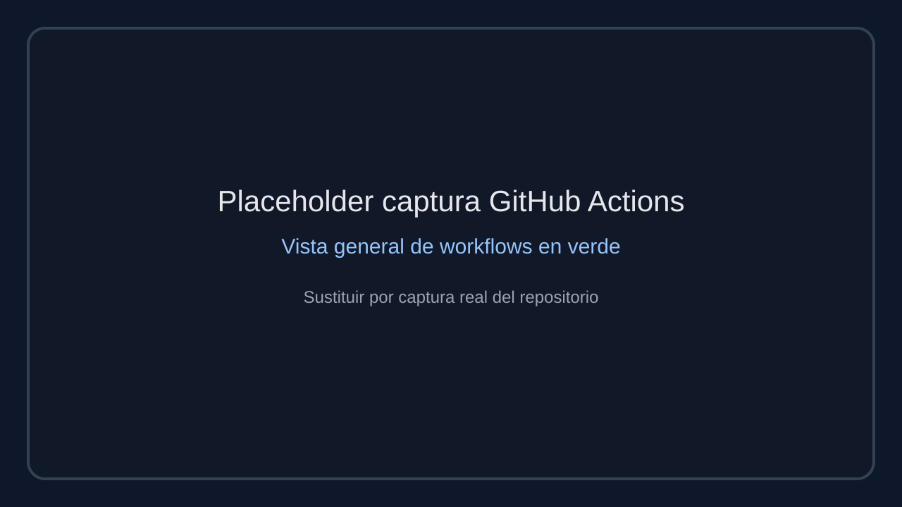
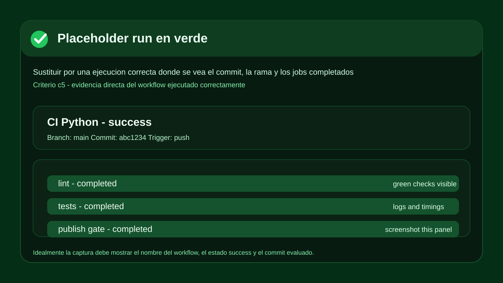
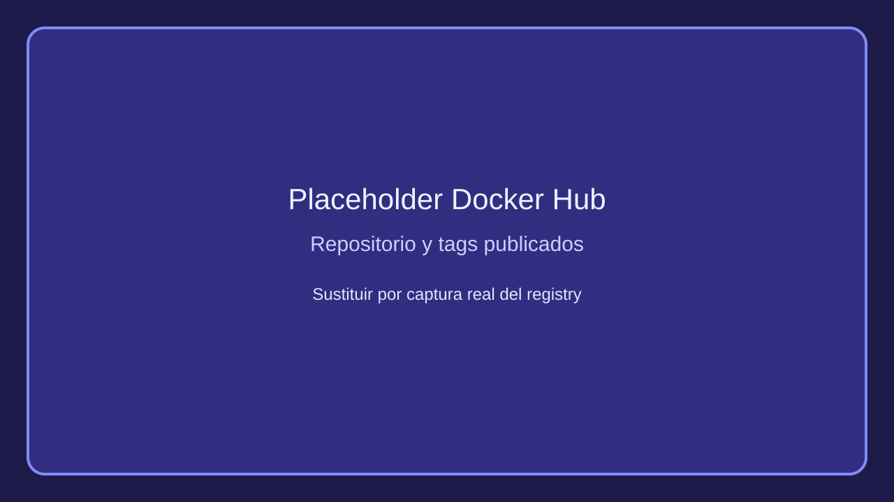
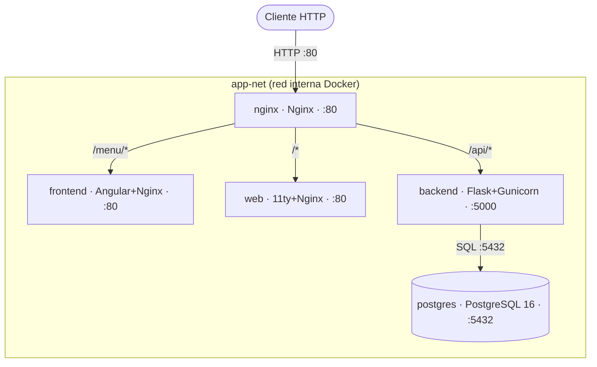
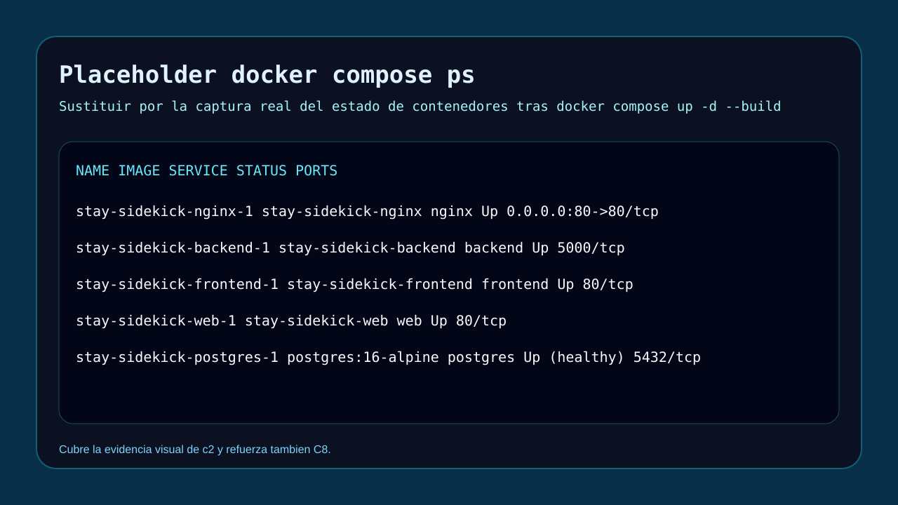
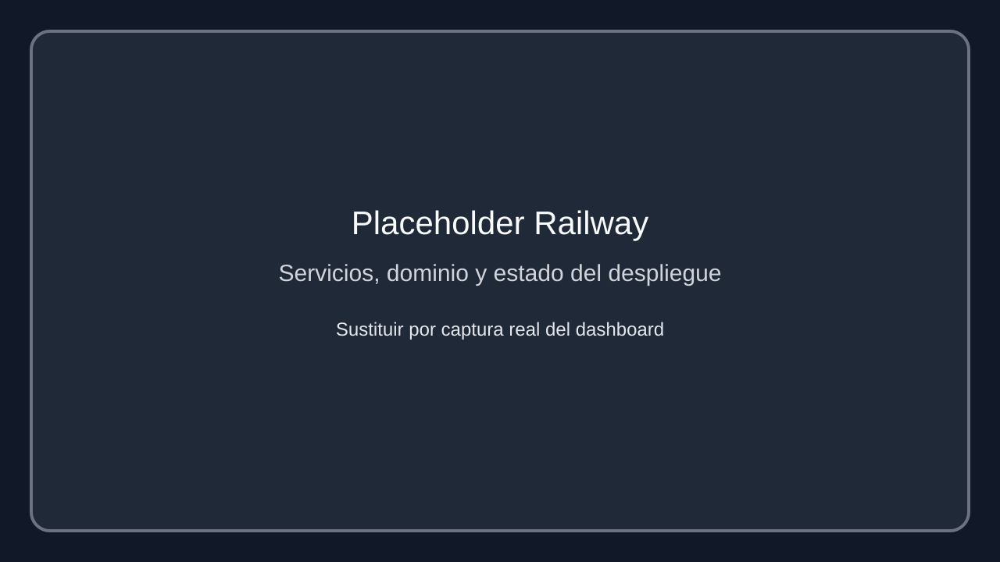

# 08. Despliegue de la aplicación web

> Documento adicional para la evaluación del módulo de Despliegue de Aplicaciones Web.
> No sustituye a [08-despliegue.md](08-despliegue.md): lo complementa con evidencias directas alineadas con la rúbrica (`c1` a `c6`, `C7` y `C8`).

---

## Índice

- [c6: Documentación del proyecto](#c6--documentación-del-proyecto)
- [c5: Control de versiones y CI/CD](#c5--control-de-versiones-y-cicd)
- [c1 — Arquitectura de la aplicación](#c1--arquitectura-de-la-aplicación)
- [c2 — Implementación en Docker](#c2--implementación-en-docker)
- [c3 — Servidor web como front (reverse proxy)](#c3--servidor-web-como-front-reverse-proxy)
- [c4 — Servidor de aplicaciones (backend)](#c4--servidor-de-aplicaciones-backend)
- [C7 — Gestión de ficheros y artefactos](#c7--gestión-de-ficheros-y-artefactos)
- [C8 — Verificación de red del despliegue](#c8--verificación-de-red-del-despliegue)

---

## c6: Documentación del proyecto

### Qué es Stay Sidekick

Stay Sidekick es una plataforma web satélite para operaciones del alquiler vacacional. No sustituye al PMS; añade herramientas operativas que normalmente están dispersas o no existen en los PMS generalistas: maestro de apartamentos, mapa de calor, notificaciones de check-in tardío, sincronización de contactos y vault de comunicaciones con asistencia IA.

### Estructura de documentación del repositorio

La documentación válida para la memoria del TFG queda concentrada en el capítulo general de
despliegue y en este documento complementario de evidencias. El objetivo de esta sección es
recoger en un único punto los elementos que justifican la arquitectura desplegada, la
containerización, la cadena CI/CD y las comprobaciones de red y publicación.

| Fichero / carpeta | Contenido |
| --- | --- |
| [README.md](../README.md) | Qué hace el proyecto, requisitos, arranque rápido, arquitectura, CI/CD, HTTPS |
| [DEPLOY.md](../DEPLOY.md) | Guía paso a paso de despliegue local y en remoto, variables de entorno, troubleshooting completo |
| [docs/](../docs/) | Documentación técnica extendida (introducción, diseño, desarrollo, pruebas, despliegue) |
| [docs/08-despliegue.md](08-despliegue.md) | Despliegue con diagrama de arquitectura, CI/CD, proceso de producción |
| [backend/app/docs/openapi.yaml](../backend/app/docs/openapi.yaml) | Contrato OpenAPI 3.0 con autenticación JWT, CSRF, roles, servidores y endpoints documentados |
| [backend/app/docs/routes.py](../backend/app/docs/routes.py) | Blueprint de documentación que expone Swagger UI en `/api/docs` y la spec en `/api/docs/openapi.yaml` |
| Este fichero | Documentación orientada a la rúbrica de evaluación |

### API documentada con ejemplos reales

La API queda documentada por tres vías complementarias: ejemplos reales de uso, especificación
OpenAPI integrada en el backend y una interfaz Swagger UI servida por el blueprint `docs`.

En el estado actual del backend, las rutas documentales implementadas son:

- `GET /api/docs` -> interfaz Swagger UI
- `GET /api/docs/openapi.yaml` -> especificación OpenAPI 3.0 en YAML

### Cómo acceder a Swagger UI y OpenAPI

Como `nginx` reenvía todo `/api/*` al backend, la consola Swagger y la spec OpenAPI se consultan
por las mismas URLs públicas que el resto de la API, sin exponer un puerto adicional del backend.

| Entorno | Swagger UI | OpenAPI YAML |
| --- | --- | --- |
| Local (Docker Compose) | `http://localhost/api/docs` | `http://localhost/api/docs/openapi.yaml` |
| Railway | `https://staysidekick.up.railway.app/api/docs` | `https://staysidekick.up.railway.app/api/docs/openapi.yaml` |
| Dominio final | `https://stay-sidekick.com/api/docs` | `https://stay-sidekick.com/api/docs/openapi.yaml` |

Acceso recomendado:

- En navegador: abrir `/api/docs` para usar la consola Swagger UI.
- En terminal: consultar `/api/docs/openapi.yaml` para descargar o inspeccionar la especificación.
- En validación local: levantar primero el stack con `docker compose up -d --build`, ya que el
  backend no se publica directamente y la documentación sale a través del proxy `nginx`.

Ejemplos reales de verificación local:

```bash
# ── Documentación interactiva ─────────────────────────────────────────────

# Swagger UI servida por el backend
curl -I -s http://localhost/api/docs
# HTTP/1.1 200 OK
# Content-Type: text/html; charset=utf-8

# Contrato OpenAPI en YAML
curl -s http://localhost/api/docs/openapi.yaml | head -n 6
# openapi: 3.0.3
# info:
#   title: Stay Sidekick API
#   version: 1.0.0

# ── CSRF y autenticación ──────────────────────────────────────────────────

# Obtener token CSRF y guardarlo también como cookie
CSRF=$(curl -s -c cookies.txt http://localhost/api/csrf-token \
  | python -c "import sys,json; print(json.load(sys.stdin)['csrf_token'])")
# -> token emitido en JSON y cookie csrf_token persistida en cookies.txt

# Login con JWT (requiere usuario válido y double-submit cookie)
curl -s -b cookies.txt -X POST http://localhost/api/auth/login \
  -H "Content-Type: application/json" \
  -H "X-CSRF-Token: $CSRF" \
  -d '{"email":"<email_valido>","password":"<password_valida>"}'
# -> {"ok":true,"token":"<jwt>","debe_cambiar_password":false}

# ── Verificación mínima vía proxy ─────────────────────────────────────────

# Healthcheck público
curl -s http://localhost/api/health
# {"status":"ok"}

# Ruta protegida sin JWT
curl -i -s http://localhost/api/usuarios
# HTTP/1.1 401 UNAUTHORIZED
# {"errors":["Token de acceso requerido."],"ok":false}
```

Códigos de respuesta comunes documentados en la API:

- `200 OK` -> operación correcta o consulta resuelta.
- `201 Created` -> recurso creado correctamente.
- `400 Bad Request` -> cuerpo no JSON o petición mal formada.
- `401 Unauthorized` -> JWT ausente, inválido o credenciales incorrectas.
- `403 Forbidden` -> CSRF inválido o permisos insuficientes.
- `422 Unprocessable Entity` -> errores de validación de payload.
- `429 Too Many Requests` -> límite de peticiones superado.

Esto evidencia que la documentación no es solo descriptiva: permite probar endpoints reales con comandos reproducibles.

---

## c5: Control de versiones y CI/CD

### Uso de Git, trazabilidad de cambios y ramas

El repositorio mantiene `main` como rama estable y emplea ramas temáticas para aislar trabajo de desarrollo y documentación. Esto deja trazabilidad clara entre cada línea de trabajo, los commits que la componen y el momento en que se integra en la rama principal. En el historial del proyecto se observan ramas `dev-*`, `fix-*`, `docs-*` y ramas de refactor por dominio.

Ejemplos reales de ramas visibles en el repositorio:

```text
dev-herramientas
dev-mail-service
dev-ui-estandarizacion
docs-documentacion-final
docs-gobernanza-comunidad
main
```

Extracto real de commits representativos en ramas relevantes del proyecto:

```text
main
  3dfff77 fix: corregir errores de accesibilidad WAVE (botón theme-toggle vacío, inputs file con aria-hidden redundante, th checkbox vacío, contraste dropdown y aria-label vacío en búsqueda de usuarios)
  8fdd0e0 fix: externalizar script anti-FOUC a theme-init.js para cumplir Content-Security-Policy

dev-herramientas
  ee019f6 fix: actualizar rutas de redirección para incluir barras finales y mejorar la consistencia en la navegación
  0fdb0a8 fix: añadir barras finales a las rutas en la configuración de Nginx y enlaces de navegación para mejorar la consistencia y evitar redirecciones innecesarias

dev-ui-estandarizacion
  212d048 feat: sincronizar preferencia de tema entre Angular y 11ty mediante evento storage
  749a014 feat: añadir átomo Tag y migrar meta-chip a app-tag en herramientas Angular y macro NJK
```

Se ha elegido `dev-ui-estandarizacion` como tercera rama porque aporta mejoras recientes y
transversales sobre la interfaz, el design system y la coherencia visual entre Angular y 11ty.

### Workflows reales de GitHub Actions

En esta rama, el directorio [.github/workflows](../.github/workflows) contiene cinco workflows
activos. La separación por stack evita mezclar validaciones de backend, frontend, web estática y
publicación de imágenes.

| Workflow | Fichero | Disparo | Función real |
| --- | --- | --- | --- |
| `CI Python` | [.github/workflows/ci-python.yml](../.github/workflows/ci-python.yml) | `push` y `pull_request` sobre `main` | Ejecuta `ruff`, levanta `postgres:16-alpine` como servicio y lanza `pytest` con Python 3.12 |
| `CI — Tests y cobertura` | [.github/workflows/ci-angular-tests.yml](../.github/workflows/ci-angular-tests.yml) | `push` en cualquier rama y `pull_request` sobre `main` | Ejecuta tests Angular con cobertura, sube el artefacto `coverage-report` y después valida el build de producción |
| `CI Angular` | [.github/workflows/ci-angular.yml](../.github/workflows/ci-angular.yml) | `push` y `pull_request` sobre `main` | Compila el frontend Angular en modo de producción |
| `CI 11ty` | [.github/workflows/ci-web.yml](../.github/workflows/ci-web.yml) | `push` y `pull_request` sobre `main` | Construye el sitio estático 11ty con Node 22 |
| `Docker Hub` | [.github/workflows/docker-publish.yml](../.github/workflows/docker-publish.yml) | `workflow_run` en `main` | Comprueba con la API de GitHub que `CI Angular`, `CI 11ty` y `CI Python` han terminado en `success` para el mismo commit y, si se cumple, publica cuatro imágenes Docker |

### Cadena CI/CD aplicada al despliegue

La promoción a artefactos desplegables sigue una secuencia explícita y verificable:

1. Los cambios que llegan a `main` disparan los workflows base de backend, Angular y 11ty.
2. El workflow `CI — Tests y cobertura` añade validación extra del frontend y conserva el
   directorio `frontend/coverage/` como artefacto descargable durante 14 días.
3. El workflow `Docker Hub` no se limita a esperar un disparo; consulta el estado de los runs del
   mismo `head_sha` y solo avanza cuando `CI Angular`, `CI 11ty` y `CI Python` devuelven
   `success`.
4. Superada esa puerta, se construyen y publican las imágenes `stay-sidekick-backend`,
   `stay-sidekick-frontend`, `stay-sidekick-web` y `stay-sidekick-nginx`, todas etiquetadas con el
   SHA corto del commit.

Esto implica que el workflow de tests y cobertura del frontend aporta calidad y evidencia, pero no
forma parte de la puerta dura del `workflow_run` que desbloquea la publicación en Docker Hub.

Snippet real del workflow de tests y cobertura:

```yaml
- name: Ejecutar tests con cobertura
  working-directory: frontend
  run: npx ng test --watch=false

- name: Subir informe de cobertura
  if: always()
  uses: actions/upload-artifact@v4
  with:
    name: coverage-report
    path: frontend/coverage/
    retention-days: 14
```

Snippet real de la publicación Docker condicionada:

```yaml
on:
  workflow_run:
    workflows: [CI Angular, CI 11ty, CI Python]
    types: [completed]
    branches: [main]

- name: Imagen nginx
  run: |
    docker build -t $HUB_USER/stay-sidekick-nginx:${{ steps.meta.outputs.sha }} ./nginx
    docker push $HUB_USER/stay-sidekick-nginx:${{ steps.meta.outputs.sha }}
```

Credenciales y secretos utilizados en la cadena:

- `DOCKERHUB_USERNAME`
- `DOCKERHUB_TOKEN`
- `TURNSTILE_SITE_KEY`
- `github.token` para consultar, desde GitHub Actions, el estado de los workflows asociados al commit

El soporte principal de este apartado sigue estando en los propios ficheros YAML, en el historial Git
reproducible y en la trazabilidad entre commit, ejecución de CI y etiquetas SHA de las imágenes
publicadas. Aun así, para alinearlo literalmente con la rúbrica, conviene adjuntar tres capturas
concretas: el panel general de GitHub Actions, un run correcto en verde y el registry con los tags
publicados.

### Capturas recomendadas para cerrar c5

Estas tres evidencias visuales cubren exactamente lo que la rúbrica pide en control de versiones y
CI/CD. Mientras no se sustituyan por capturas reales, el documento conserva placeholders SVG para no
dejar referencias rotas ni perder la estructura de la entrega.







---

## c1 — Arquitectura de la aplicación

### Diagrama de servicios y comunicaciones



### Descripción de servicios

| Servicio | Evidencia | Puerto | Rol |
| --- | --- | --- | --- |
| `nginx` | [docker-compose.yml](../docker-compose.yml), [nginx/nginx.conf](../nginx/nginx.conf) | `80` público | Punto único de entrada, reverse proxy y cabeceras de seguridad |
| `frontend` | [frontend/Dockerfile](../frontend/Dockerfile) | `80` interno | SPA Angular |
| `web` | [web/Dockerfile](../web/Dockerfile) | `80` interno | Sitio estático 11ty |
| `backend` | [backend/Dockerfile](../backend/Dockerfile) | `5000` interno | API Flask y lógica de negocio |
| `postgres` | [docker-compose.yml](../docker-compose.yml) | `5432` interno | Persistencia relacional |

Snippet real de la orquestación:

```yaml
nginx:
  ports:
    - "80:80"

backend:
  expose:
    - "5000"
  depends_on:
    postgres:
      condition: service_healthy

postgres:
  image: postgres:16-alpine
  expose:
    - "5432"
```

La separación es clara: solo se expone `nginx`, mientras que backend y base de datos quedan en red interna. Esto cumple el criterio de arquitectura por servicios diferenciados y comunicación interna explícita.

---

## c2 — Implementación en Docker

### Ficheros principales de despliegue reproducible

| Elemento | Ruta |
| --- | --- |
| Orquestación | [docker-compose.yml](../docker-compose.yml) |
| Variables raíz | [.env.example](../.env.example) |
| Variables backend | [backend/.env.example](../backend/.env.example) |
| Imagen backend | [backend/Dockerfile](../backend/Dockerfile) |
| Imagen frontend | [frontend/Dockerfile](../frontend/Dockerfile) |
| Imagen web | [web/Dockerfile](../web/Dockerfile) |
| Imagen nginx | [nginx/Dockerfile](../nginx/Dockerfile) |

### Arranque reproducible desde cero

```bash
cp .env.example .env
cp backend/.env.example backend/.env
docker compose up -d --build
docker compose ps
```

### Salida real de `docker compose ps`

```text
NAME                       IMAGE                    COMMAND                  SERVICE    STATUS                    PORTS
stay-sidekick-backend-1    stay-sidekick-backend    "/bin/sh -c 'flask d…"   backend    Up 7 seconds              5000/tcp
stay-sidekick-frontend-1   stay-sidekick-frontend   "/docker-entrypoint.…"   frontend   Up 13 seconds             80/tcp
stay-sidekick-nginx-1      stay-sidekick-nginx      "/docker-entrypoint.…"   nginx      Up 6 seconds              0.0.0.0:80->80/tcp, [::]:80->80/tcp
stay-sidekick-postgres-1   postgres:16-alpine       "docker-entrypoint.s…"   postgres   Up 13 seconds (healthy)   5432/tcp
stay-sidekick-web-1        stay-sidekick-web        "/docker-entrypoint.…"   web        Up 13 seconds             80/tcp
```

Esto demuestra:

- despliegue reproducible con Compose
- un único puerto público (`80`)
- base de datos con `healthcheck`
- backend, frontend y web accesibles por red interna

Placeholders de captura para la evidencia visual:



### Imágenes y artefactos locales generados

Salida real de `docker compose images`:

```text
CONTAINER                  REPOSITORY               TAG         IMAGE ID       SIZE
stay-sidekick-backend-1    stay-sidekick-backend    latest      5c3857e918c3   184MB
stay-sidekick-frontend-1   stay-sidekick-frontend   latest      079bfc2ef05b   36MB
stay-sidekick-nginx-1      stay-sidekick-nginx      latest      3c31d3fbdd83   25.9MB
stay-sidekick-postgres-1   postgres                 16-alpine   a5074487380d   110MB
stay-sidekick-web-1        stay-sidekick-web        latest      9d3fa9e61f22   35.8MB
```

En remoto, el workflow de CD publica imágenes en Docker Hub usando el usuario configurado en `DOCKERHUB_USERNAME`, con nombres `stay-sidekick-backend`, `stay-sidekick-frontend`, `stay-sidekick-web` y `stay-sidekick-nginx`.

---

## c3 — Servidor web como front (reverse proxy)

### Configuración relevante del proxy

Fichero: [nginx/nginx.conf](../nginx/nginx.conf)

```nginx
location /api/ {
    proxy_pass         http://backend_upstream;
    proxy_set_header   Host              $host;
    proxy_set_header   X-Real-IP         $remote_addr;
    proxy_set_header   X-Forwarded-For   $proxy_add_x_forwarded_for;
    proxy_set_header   X-Forwarded-Proto $scheme;
}

location /menu {
    rewrite ^/menu/?(.*)$ /$1 break;
    proxy_pass         http://frontend_upstream;
}

location / {
    proxy_intercept_errors on;
    proxy_pass         http://web_upstream;
}
```

Esto evidencia que `nginx` actúa como front real:

- sirve el sitio estático en `/`
- envía la SPA Angular a `/menu`
- proxy-pasa la API a `/api`
- añade cabeceras de seguridad (`X-Frame-Options`, `X-Content-Type-Options`, `Referrer-Policy`, `Content-Security-Policy`)

### Comprobaciones reales con `curl`

Front:

```bash
curl -I -s http://localhost/
```

```text
HTTP/1.1 200 OK
Server: nginx/1.29.4
Content-Type: text/html
X-Frame-Options: SAMEORIGIN
X-Content-Type-Options: nosniff
Referrer-Policy: strict-origin-when-cross-origin
Content-Security-Policy: default-src 'self'; ...
```

API protegida a través del proxy:

```bash
curl -i -s http://localhost/api/usuarios
```

```text
HTTP/1.1 401 UNAUTHORIZED
Server: nginx/1.29.4
Content-Type: application/json

{"errors":["Token de acceso requerido."],"ok":false}
```

La respuesta `401` en JSON prueba que la petición entra por `nginx`, atraviesa el reverse proxy y es respondida por Flask, no por un `404` HTML local.

### Logs reales del proxy

```bash
docker compose logs --tail=5 nginx
```

```text
nginx-1  | 172.18.0.1 - - [15/May/2026:18:03:49 +0000] "HEAD / HTTP/1.1" 200 0 "-" "PowerShell/7.5.5" "-"
nginx-1  | 172.18.0.1 - - [15/May/2026:18:03:51 +0000] "GET /api/health HTTP/1.1" 200 16 "-" "PowerShell/7.5.5" "-"
nginx-1  | 172.18.0.1 - - [15/May/2026:18:03:51 +0000] "GET /api/usuarios HTTP/1.1" 401 53 "-" "PowerShell/7.5.5" "-"
```

En producción, el dominio público se sirve mediante Railway (`https://staysidekick.up.railway.app`), que proporciona HTTPS en el borde y reenvía al servicio `nginx`.

---

## c4 — Servidor de aplicaciones (backend)

### Evidencia del servidor de aplicaciones

Fichero: [backend/Dockerfile](../backend/Dockerfile)

```dockerfile
CMD flask db upgrade && gunicorn --bind "[::]:${PORT:-5000}" --workers 2 run:app
```

Esto demuestra que el backend no corre con el servidor de desarrollo de Flask, sino con Gunicorn, que es adecuado como servidor de aplicaciones para despliegue.

Comando real del proceso principal dentro del contenedor:

```bash
docker compose exec backend sh -lc "tr '\0' ' ' </proc/1/cmdline"
```

```text
/bin/sh -c flask db upgrade && gunicorn --bind "[::]:${PORT:-5000}" --workers 2 run:app
```

### Healthcheck implementado en la aplicación

Fichero: [backend/app/__init__.py](../backend/app/__init__.py)

```python
@app.route("/api/health")
def health():
    return jsonify({"status": "ok"}), 200
```

Comprobación real:

```bash
curl -s http://localhost/api/health
```

```text
{"status":"ok"}
```

### Prueba ligera de funcionamiento y respuesta

Se lanzó una prueba simple de 20 peticiones consecutivas al endpoint `/api/health`:

```powershell
$sw = [System.Diagnostics.Stopwatch]::StartNew()
1..20 | ForEach-Object { Invoke-RestMethod -Uri 'http://localhost/api/health' | Out-Null }
$sw.Stop()
```

Resultado real:

```text
Requests : 20
TotalMs  : 97,38
AvgMs    : 4,87
```

Interpretación: para una carga ligera local, el backend respondió de forma consistente y sin errores, con una media inferior a 5 ms por petición al healthcheck.

### Logs del backend

```bash
docker compose logs --tail=5 backend
```

```text
backend-1  | 2026-05-15 18:03:50,182 [DEBUG] LiteLLM: Using AiohttpTransport...
backend-1  | 18:03:50 - LiteLLM:DEBUG: http_handler.py:862 - Creating AiohttpTransport...
backend-1  | 2026-05-15 18:03:50,182 [DEBUG] LiteLLM: Creating AiohttpTransport...
```

Aunque el extracto mostrado pertenece a inicialización del cliente IA, evidencia que el backend está generando logs operativos dentro del contenedor y que la aplicación está viva.

---

## C7 — Gestión de ficheros y artefactos

### Inventario de artefactos relevantes del despliegue

| Artefacto | Ruta | Se versiona | Uso |
| --- | --- | :---: | --- |
| Compose | [docker-compose.yml](../docker-compose.yml) | Sí | Define servicios, red, volúmenes y puertos |
| Variables raíz | [.env.example](../.env.example) | Sí | Plantilla para PostgreSQL y `DATABASE_URL` |
| Variables backend | [backend/.env.example](../backend/.env.example) | Sí | Plantilla para Flask, JWT, Google, Gmail, Discord, IA y Smoobu |
| Variables reales | `.env`, `backend/.env` | No | Secretos del entorno local o productivo |
| Dockerfiles | [backend/Dockerfile](../backend/Dockerfile), [frontend/Dockerfile](../frontend/Dockerfile), [web/Dockerfile](../web/Dockerfile), [nginx/Dockerfile](../nginx/Dockerfile) | Sí | Generan las imágenes del stack |
| Config del proxy | [nginx/nginx.conf](../nginx/nginx.conf) | Sí | Enrutado y cabeceras del front |
| Workflows | [.github/workflows](../.github/workflows) | Sí | CI/CD y publicación de imágenes |
| Volumen persistente | `postgres_data` | Se crea localmente | Conserva datos de PostgreSQL entre reinicios |

### Evidencia de gestión correcta de secretos

Salida real de comprobación:

```bash
git check-ignore -v .env
git ls-files .env
```

```text
.gitignore:79:.env      .env
```

La ausencia de salida en `git ls-files .env` confirma que el archivo real de secretos no está versionado.

### Evidencia de volúmenes persistentes

```bash
docker volume ls --filter name=stay-sidekick
```

```text
DRIVER    VOLUME NAME
local     stay-sidekick_postgres_data
```

En el despliegue actual, el volumen persistente esencial es `postgres_data`, donde se conserva la base de datos completa.

### Evidencia de imágenes generadas

Además de las imágenes locales del `docker compose images`, el workflow `docker-publish.yml` construye y publica cuatro imágenes con SHA corto:

- `stay-sidekick-backend`
- `stay-sidekick-frontend`
- `stay-sidekick-web`
- `stay-sidekick-nginx`

Placeholders de capturas recomendadas para evaluación:



La evidencia visual del registry y de los tags publicados ya se ha situado en `c5`, donde encaja
mejor con la rúbrica de CI/CD y evita duplicar la misma captura en dos apartados.

---

## C8 — Verificación de red del despliegue

### URLs, puertos y servicio que responde

| URL / ruta | Puerto | Servicio que responde | Qué se comprueba |
| --- | --- | --- | --- |
| `http://localhost/` | `80` | `nginx` -> `web` | Acceso al front público |
| `http://localhost/menu/` | `80` | `nginx` -> `frontend` | Acceso a la SPA Angular |
| `http://localhost/api/health` | `80` | `nginx` -> `backend` | Healthcheck de la API vía proxy |
| `http://localhost/api/usuarios` | `80` | `nginx` -> `backend` | Ruta protegida y control de acceso |
| `https://staysidekick.up.railway.app` | `443` | Railway -> `nginx` | Dominio público en producción |

### Estado y puertos publicados

La salida real de `docker compose ps` muestra que solo `nginx` expone un puerto al host:

```text
stay-sidekick-nginx-1      stay-sidekick-nginx      Up 6 seconds              0.0.0.0:80->80/tcp, [::]:80->80/tcp
stay-sidekick-backend-1    stay-sidekick-backend    Up 7 seconds              5000/tcp
stay-sidekick-postgres-1   postgres:16-alpine       Up 13 seconds (healthy)   5432/tcp
```

Interpretación: el host entra por `80`, mientras backend y PostgreSQL permanecen solo en la red Docker interna.

### Pruebas reproducibles con `curl`

Front:

```bash
curl -I -s http://localhost/
```

```text
HTTP/1.1 200 OK
Server: nginx/1.29.4
Content-Type: text/html
```

Backend a través del proxy:

```bash
curl -s http://localhost/api/health
```

```text
{"status":"ok"}
```

Ruta protegida:

```bash
curl -i -s http://localhost/api/usuarios
```

```text
HTTP/1.1 401 UNAUTHORIZED
{"errors":["Token de acceso requerido."],"ok":false}
```

### Comunicación interna entre servicios

```bash
docker network ls --filter name=stay-sidekick
docker network inspect stay-sidekick_app-net --format '{{range .Containers}}{{.Name}} {{.IPv4Address}}{{println}}{{end}}'
```

```text
NETWORK ID     NAME                    DRIVER    SCOPE
400435ca2c46   stay-sidekick_app-net   bridge    local

stay-sidekick-postgres-1 172.18.0.3/16
stay-sidekick-backend-1 172.18.0.5/16
stay-sidekick-web-1 172.18.0.4/16
stay-sidekick-frontend-1 172.18.0.2/16
stay-sidekick-nginx-1 172.18.0.6/16
```

Esto confirma que los cinco contenedores comparten la misma red bridge y se comunican por nombre de servicio.

### Verificación del aislamiento

El backend y PostgreSQL no deben responder directamente desde el host:

```bash
curl -s -o NUL -w "%{http_code}" --max-time 2 http://localhost:8080/api/health
curl -s -o NUL -w "%{http_code}" --max-time 2 http://localhost:5432
```

```text
000
000
```

El código `000` demuestra que no hay publicación directa de esos puertos hacia el host, por lo que el único punto de entrada es el proxy `nginx`.

---

## Capturas pendientes para “excelente”

Las capturas recomendadas para redondear la evaluación visual siguen pendientes. Se han dejado
placeholders SVG para no romper el documento mientras se sustituyen por capturas reales.

1. `01-github-actions-general-placeholder.svg`: vista general del panel de GitHub Actions con los
  workflows visibles.
2. `02-github-actions-run-verde-placeholder.svg`: detalle de una ejecución correcta en verde donde
  se vean jobs y commit asociados.
3. `03-docker-compose-ps-placeholder.svg`: evidencia visual del estado del stack local tras
  `docker compose up -d --build`.
4. `04-docker-hub-tags-placeholder.svg`: repositorios e imágenes publicadas con tag SHA corto.
5. `05-railway-servicios-placeholder.svg`: vista del proyecto en Railway con `nginx` como entrada
  pública y el resto de servicios en red privada.

Con ese bloque de cinco capturas el documento queda cubierto visualmente para `c2`, `c5`, `C7` y
`C8` sin tocar el nombre del fichero ni mezclarlo con `08-despliegue.md`.