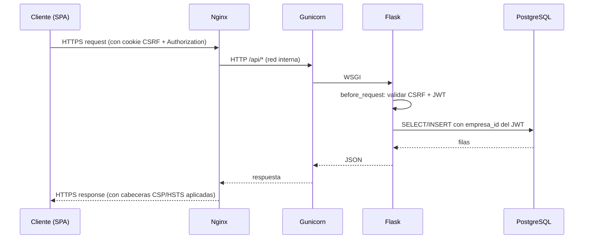

# Arquitectura del backend

## Application factory

`backend/app/__init__.py` exporta `create_app(config_class)` siguiendo el patrón **application factory** recomendado por Flask. La función:

1. Crea la instancia `Flask`.
2. Carga `app/config.py` (`Config`, `DevConfig`, `ProdConfig`) según `FLASK_ENV`.
3. Inicializa las extensiones de `app/extensions.py` (SQLAlchemy, Migrate, JWT, Limiter, BCrypt).
4. Registra los **Blueprints** de cada subdominio.
5. Registra los handlers globales de `app/exceptions.py`.

Esto permite levantar la misma app con configuraciones distintas (tests con `TestingConfig`, dev con `DevConfig`, prod con `ProdConfig`) sin reescribir nada.

## Multitenancy

Cada usuario pertenece a una `Empresa` (`models/empresa.py`). El acceso a datos:

- Las queries de SQLAlchemy **siempre filtran por `empresa_id`**, derivado del JWT del request actual.
- No hay sesión global compartida entre empresas — el aislamiento ocurre a nivel de query, no de esquema.
- Los datos operativos de huéspedes se procesan en memoria y **no persisten** en BD (alineado con RGPD).

## Ciclo request/response

## Blueprints registrados

| Blueprint | Prefijo | Responsable |
|-----------|---------|-------------|
| `auth` | `/api/auth` | Login, refresh, cambio de password, logout |
| `perfil` | `/api/perfil` | Datos del usuario + configuración de empresa |
| `empresas` | `/api/empresas` | CRUD de empresas (rol superadmin) |
| `solicitud` | `/api/solicitudes` | Alta pública de empresa con anti-spam |
| `contact` | `/api/contact` | Formulario público de contacto |
| `h_maestro_apartamentos` | `/api/maestro-apartamentos` | Catálogo de apartamentos por empresa |
| `h_mapa_de_calor` | `/api/heatmap` | Mapa de calor operativo (sin persistencia) |
| `h_notificaciones_tardias` | `/api/notificaciones-tardias` | Detección de check-ins del día |
| `h_sincronizador_contactos` | `/api/contactos` | Sync con Google People API |
| `h_vault_comunicaciones` | `/api/vault` | Plantillas + asistente IA |

## Migraciones

Alembic gestiona el schema. El `Dockerfile` ejecuta `flask db upgrade` antes de arrancar Gunicorn, por lo que el contenedor siempre converge al schema actual en cada despliegue (idempotente).

## Tests y cobertura

- **92 casos** en 12 archivos (7 suites de integración HTTP, 5 unitarias de servicio).
- Lint con **ruff** ejecutado como paso previo en CI.
- Umbral mínimo **90 %** de cobertura. El pipeline rompe si baja.
