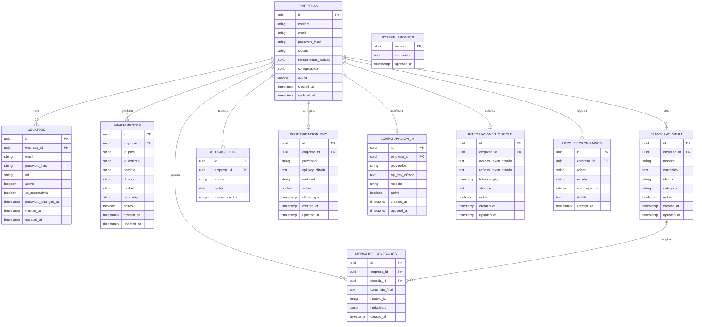

# Diagrama Entidad-Relación — Stay Sidekick

```mermaid
erDiagram

    EMPRESAS {
        uuid id PK
        string nombre
        string email
        string password_hash
        string ciudad
        jsonb herramientas_activas
        jsonb configuracion
        boolean activa
        timestamp created_at
        timestamp updated_at
    }

    USUARIOS {
        uuid id PK
        uuid empresa_id FK
        string email
        string password_hash
        string rol
        boolean activo
        boolean es_superadmin
        timestamp password_changed_at
        timestamp created_at
        timestamp updated_at
    }

    APARTAMENTOS {
        uuid id PK
        uuid empresa_id FK
        string id_pms
        string id_externo
        string nombre
        string direccion
        string ciudad
        string pms_origen
        boolean activo
        timestamp created_at
        timestamp updated_at
    }

    PLANTILLAS_VAULT {
        uuid id PK
        uuid empresa_id FK
        string nombre
        text contenido
        string idioma
        string categoria
        boolean activa
        timestamp created_at
        timestamp updated_at
    }

    MENSAJES_GENERADOS {
        uuid id PK
        uuid empresa_id FK
        uuid plantilla_id FK
        text contenido_final
        string modelo_ia
        jsonb metadatos
        timestamp created_at
    }

    AI_USAGE_LOG {
        uuid id PK
        uuid empresa_id FK
        string accion
        date fecha
        integer tokens_usados
    }

    SYSTEM_PROMPTS {
        string nombre PK
        text contenido
        timestamp updated_at
    }

    CONFIGURACION_PMS {
        uuid id PK
        uuid empresa_id FK
        string proveedor
        text api_key_cifrada
        string endpoint
        boolean activo
        timestamp ultimo_sync
        timestamp created_at
        timestamp updated_at
    }

    CONFIGURACION_IA {
        uuid id PK
        uuid empresa_id FK
        string proveedor
        text api_key_cifrada
        string modelo
        boolean activo
        timestamp created_at
        timestamp updated_at
    }

    INTEGRACIONES_GOOGLE {
        uuid id PK
        uuid empresa_id FK
        text access_token_cifrado
        text refresh_token_cifrado
        timestamp token_expiry
        text alcance
        boolean activo
        timestamp created_at
        timestamp updated_at
    }

    LOGS_SINCRONIZACION {
        uuid id PK
        uuid empresa_id FK
        string origen
        string estado
        integer num_registros
        text detalle
        timestamp created_at
    }

    EMPRESAS ||--o{ USUARIOS : "tiene"
    EMPRESAS ||--o{ APARTAMENTOS : "gestiona"
    EMPRESAS ||--o{ PLANTILLAS_VAULT : "crea"
    EMPRESAS ||--o{ MENSAJES_GENERADOS : "genera"
    EMPRESAS ||--o{ AI_USAGE_LOG : "acumula"
    EMPRESAS ||--o{ LOGS_SINCRONIZACION : "registra"
    EMPRESAS ||--o| CONFIGURACION_PMS : "configura"
    EMPRESAS ||--o| CONFIGURACION_IA : "configura"
    EMPRESAS ||--o| INTEGRACIONES_GOOGLE : "conecta"
    PLANTILLAS_VAULT ||--o{ MENSAJES_GENERADOS : "origina"
```
